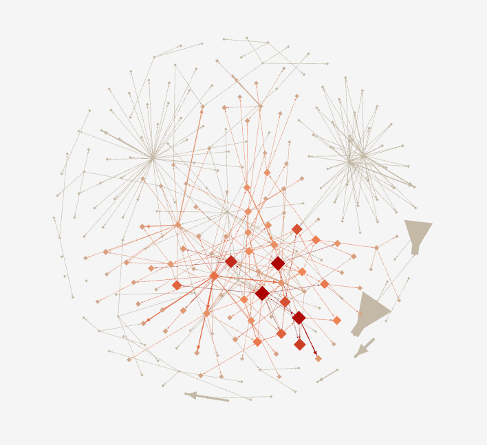
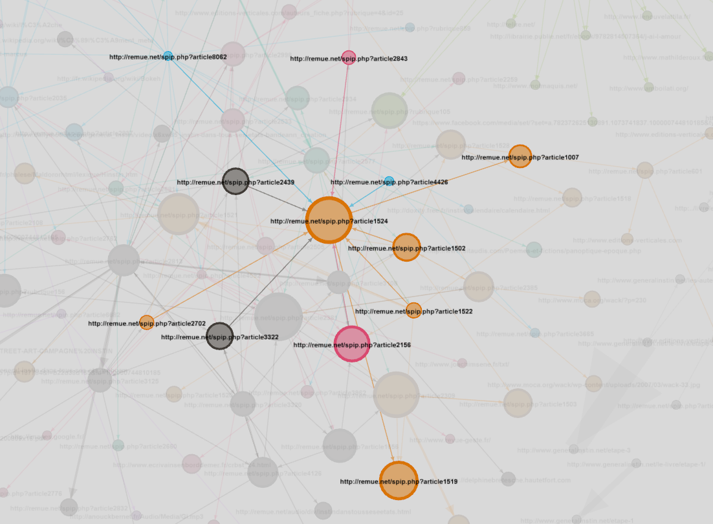
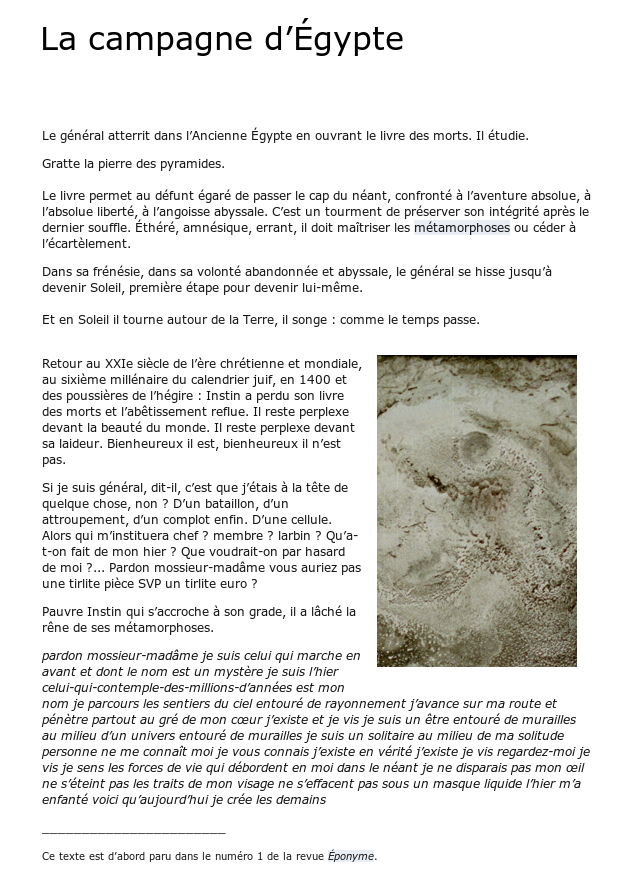
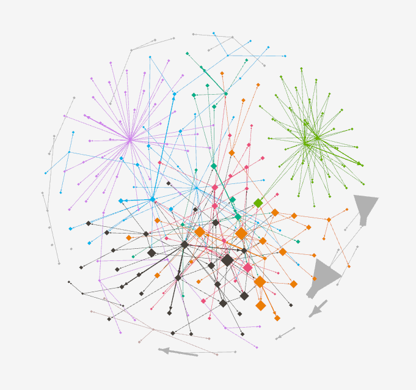
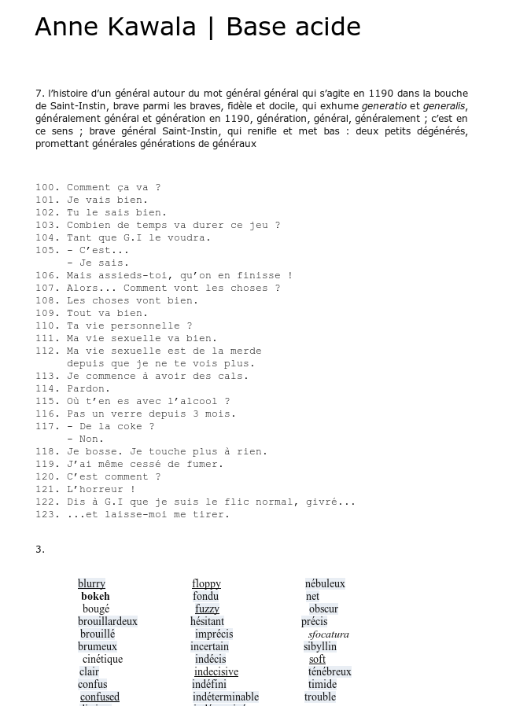

<!-- .slide: data-background-image="img/cropped-instin_climax_00.jpg" -->
<!-- .slide: class="hover"-->

## Éditorialisation et littérature le cas du Général Instin
&nbsp;

Servanne Monjour, Nicolas Sauret, Marcello Vitali-Rosati

 <!-- .element: class="logo" style="width:30%; background-color:ghostwhite;padding: 5px" -->

_Des humanités numériques littéraires ?_  
Cerisy - 15-22 juin 2017

<!-- .element: style="font-size:1.4rem" -->

 <!-- .element: class="logo" -->

%%%%%%%%%%%%%%%%%%%%%%%%%%%%%%%%%%%%%%%%%%%%%
## Chaire de recherche du Canada sur les écritures numériques

 <!-- .element: width="45%" -->
 <!-- .element: width="45%" -->

§§§§§§§§§§§§§§§§§§§§§§§§§§§§§§§§§§§§§§§§§§§§§

<!-- .slide: data-background-image="img/0-ordonnancement_rubrique_105vagues.jpg" data-background-size="contain"--->
<!-- .slide: class="hover"-->

### Questions de recherche

* Qu'est-ce que la littérature à l'époque du numérique ?
* Quel impact sur les études littéraires ?
* Quel patrimoine littéraire pour demain ?
* En quoi l'éditorialisation (théorie + ensemble de pratiques) peut-elle nous être utile ?

===

§§§§§§§§§§§§§§§§§§§§§§§§§§§§§§§§§§§§§§§§§§§§§
<!-- .slide: data-background-image="img/PostIt.jpg" -->
<!-- .slide: class="hover"-->

### Contribuer
* Twitter : #instinstudies
* Pad : https://frama.link/Cerisy2017
* Carnet : https://frama.link/instinstudies

===

%%%%%%%%%%%%%%%%%%%%%%%%%%%%%%%%%%%%%%%%%%%%%
<!-- .slide: data-background-image="img/cropped-instin_climax_00.jpg" -->
<!-- .slide: class="hover"-->

## Sommaire

* Introduction - Questions de recherche
* L'éditorialisation
* Les _Instin Studies_ : projet d'étude d'un corpus fantôme
* l'éditorialisation comme méthodologie littéraire
* _GI_ : cas d'école d'une littérature éditorialisée
* Conclusion

===

On peut écrire des notes ici.

%%%%%%%%%%%%%%%%%%%%%%%%%%%%%%%%%%%%%%%%%%%%%

<!-- .slide: data-background-image="img/JEedito063.jpg" --->

## L'éditorialisation

§§§§§§§§§§§§§§§§§§§§§§§§§§§§§§§§§§§§§§§§§§§§§
<!-- .slide: data-background-image="img/Framapad.png" -->
<!-- .slide: class="hover"-->

### Cartographie du concept
* Un néologisme récent
* Un concept interdisciplinaire
* Articulation théorie/pratique

===
Le terme éditorialisation est un néologisme récent, forgé à partir de 2004, pour désigner de nouvelles pratiques éditoriales issues des technologies numériques. Le concept reste encore instable et débattu : clairement il fait l’objet d’un intérêt très fort, mais sa définition est encore en construction.

Malgré ses frontières encore mouvantes (ce qui en fait d'ailleurs l'intérêt), le concept d'éditorialisation fédère un nombre croissant de chercheurs et d’institutions, dans une perspective interdisciplinaire. À vrai dire, les littéraires sont encore un peu à la traîne sur le terrain de l'éditorialisation, qui fait surtout l'objet d'études approfondies en info com (avec Louise Merzeau), philo (Gérard Wormser), design, bibliothéconomie...

Enfin, l’éditorialisation témoigne d'une forte volonté de faire dialoguer les théoriciens et les praticiens : ceux qui construisent des outils, des plateformes d’édition et de gestion des contenus, ceux qui réfléchissent aux conséquences culturelles, ontologiques de ces nouveaux outils. La notion implique en effet un dialogue constant entre théorie et pratique.  

Entre théorie et pratique, les praticiens sont ainsi amenés à développer une approche critique de leurs outils et environnement, et de leur côté, les théoriciens doivent nécessairement ancrer leurs concepts sur des cas concrets et une connaissance technique de l’environnement numérique.

§§§§§§§§§§§§§§§§§§§§§§§§§§§§§§§§§§§§§§§§§§§§§
<!-- .slide: data-background-image="./img/ngramEditorialisation.png" data-background-size="contain"-->
<!-- .slide: class="hover"-->

### La notion d'éditorialisation

* **2004-2007: apparition du mot**
  * Une sorte d'édition dans l'environnement numérique
  * Bachimont : le document numérique comme remédiation d'une ressource numérisée

* **2008: le terme s'institutionnalise**
  * Séminaire «Écritures numériques et éditorialisation» (Sens Public, IRI, Dicen-IDF, UdeM)

===
Pour Bachimont, l'éditorialisation est le processus par lequel une ressource est remédiée en un nouveau document numérique, impliquant la ré-interprétation de la ressource.

À partir de 2008, le terme commence ainsi à s'institutionnaliser.

Notamment avec le séminaire "Écritures numériques et éditorialisation", où l'éditorialisation se conçoit comme un espace de débat et de réfléxion - nous vous invitons à consulter les archives vidéo disponibles en ligne, pour vous faire une idée plus précise de ce chantier théorique et pratique.

L'éditorialisation permet alors de penser un processus ouvert où auteurs, collectivités, plateformes, dynamiques pratiques sont mêlées et difficiles à retracer. pas curation, pas édition... éditorialisation
pourtant ça produit une émergence de sens

§§§§§§§§§§§§§§§§§§§§§§§§§§§§§§§§§§§§§§§§§§§§§
<!-- .slide: data-background-image="img/numerique.jpg" data-background-size="contain"-->
<!-- .slide: class="hover"-->

### Enjeux et fonctions de l'éditorialisation
décrire et comprendre les processus de production, de circulation et de légitimation de la littérature à l'ère numérique ?

===
Au regard de ce balisage préliminaire, appliquée à la littérature ou aux humanités numériques littéraires, l'enjeu de l'éditorialisation est le suivant : décrire et comprendre les processus de production, la circulation et la légitimation de la littérature à l'ère numérique ?

Mine de rien, la question que l'on se pose est assez ambitieuse: au fond, il ne s'agit rien de moins que d'interroger le statut ontologique de la littérature, à l'heure où le numérique ne se pense plus seulement en termes d'outils mais bien en termes de culture.

En passant, cette réflexion à portée ontologique apporte une dimension complémentaire, peut-être orthogonale à la communication de Marine ce matin. [Littérature dans sa forme (le livre) VS littérature comme rapport imaginaire/réel]

§§§§§§§§§§§§§§§§§§§§§§§§§§§§§§§§§§§§§§§§§§§§§
<!-- .slide: data-background-image="img/rhizome.jpg" -->
<!-- .slide: class="hover"-->

### Portée de l'éditorialisation

>«La différence entre édition et éditorialisation n'est pas qu'une différence d'outils. Elle suggère plutôt une différence culturelle : l'éditorialisation n'est pas notre façon de produire du savoir en utilisant des outils numériques ; c'est notre façon de produire du savoir à l'époque du numérique, ou mieux, dans notre société numérique.»
>
> Vitali-Rosati, _Qu'est-ce que l'éditorialisation?_, Sens public 2016

<!-- .element: style="font-size:1.8rem; text-align:justify" -->

===
<!-- du coup ici on repart sur le savoir : faudrait juste bien soigner notre transition -->

[CITER]

Cette distinction entre édition et éditorialisation opérée par MVR, l'amène (et nous amène) à proposer une définition du concept dont les conséquences ontologiques sont très fortes. L'éditorialisation comprend en effet une dimension performative décisive, qui se traduit notamment par une pensée spatiale du fait numérique.

§§§§§§§§§§§§§§§§§§§§§§§§§§§§§§§§§§§§§§§§§§§§§
<!-- .slide: data-background-image="img/10458166_10153074634228797_4994304635406227180_n.jpg" -->
<!-- .slide: class="hover"-->

### Production d'espace

>«L'éditorialisation désigne l'ensemble des dynamiques qui produisent et structurent l'espace numérique. Ces dynamiques sont les interactions des actions individuelles et collectives avec un environnement numérique particulier.»
>
> Vitali-Rosati, _Qu'est-ce que l'éditorialisation?_, Sens public 2016

<!-- .element: style="font-size:1.8rem; text-align:justify" -->

===
[CITER]

L'éditorialisation, ainsi, produit l'espace, et donc produit le réel.
C'est là que le concept peut apporter beaucoup à la réflexion littéraire, en réinvestissant notamment une problématique qui lui est inhérente: celle de la mimésis, de la distinction entre imaginaire-réel, celle de son statut ontologique, de sa fonction et de son pouvoir effectif.

<!-- préciser peut-être un peu ce point-->

§§§§§§§§§§§§§§§§§§§§§§§§§§§§§§§§§§§§§§§§§§§§§
<!-- .slide: data-background-image="./img/mashupInstin.png" -->
<!-- .slide: class="hover"-->

### Editorialisation et littérature

>«Le fait de penser le geste de production des contenus numériques comme un geste de production de l’espace nous permet justement d’aller au-delà de l’opposition imaginaire/réel. Les pratiques, les discours et les technologies impliquées dans un geste d’éditorialisation ont comme résultat l’agencement d’un espace tout à fait réel, à savoir l’espace dans lequel nous vivons.»
>
> Monjour, Vitali-Rosati, Wormser, _Le fait littéraire au temps du numérique. Pour une ontologie de l'imaginaire_, 2016.

<!-- .element: style="font-size:1.8rem; text-align:justify" -->

===
<!--(anciennes notes)
Nous venons de présenter une théorie très générale de l'éditorialisation. Mais que se passe-t-il dans un contexte littéraire ?-->

[CITER]

Attention : cet article ne prétend nullement que le numérique réforme le statut ontologique de la littérature. Plus exactement, il réinvestit des problématiques littéraires très anciennes (déjà formulées chez Platon et Aristote) et met en lumière ce brouillage qui a toujours existé entre imaginaire et réel.

Si, tel que nous en avons la conviction, la littérature contribue également à la production du réel, cette question ontologique est finalement une porte d'entrée idéale pour penser le rapport entre éditorialisation et littérature.

%%%%%%%%%%%%%%%%%%%%%%%%%%%%%%%%%%%%%%%%%%%%%
<!-- .slide: data-background-image="img/generalinstinVitrail.jpg" -->

## Les Instin Studies : projet d'étude d'un corpus fantôme

===
[A partir de là, cette présentation n'engage plus que nous!]

Quoi de mieux pour mesurer l'efficacité du concept d'éditorialisation dans le champ des études littéraires, que de le confronter à un corpus hétérogène, mouvant, insaisissable, dont la nature serait en quelque sorte de ne pas avoir de nature, ou du moins d'en changer tout le temps.

Notre attention s'est ainsi portée sur le cas du Général Instin, qui semblait mobiliser différentes stratégies d'éditorialisation, en investissant les problématiques qui nous sont chères: espace, autorité, frontières imaginaire/réel.

§§§§§§§§§§§§§§§§§§§§§§§§§§§§§§§§§§§§§§§§§§§§§
<!-- .slide: data-background-image="img/instinss.jpg" -->

### _Général Instin_ : corpus (d'un) fantôme

source image: _Quand on écrira l’histoire secrète du vingt et unième siècle…_ sur remue.net  

<!-- .element: class="source" -->

===
Hinstin, c'est d'abord le nom d'un général du XIXe siècle, mort et enterré en 1905 et dont la tombe, au cimetière du Montparnasse, est ornée d'un vitrail sur lequel le portrait photographique du défunt est lui-même en train de se décomposer.

§§§§§§§§§§§§§§§§§§§§§§§§§§§§§§§§§§§§§§§§§§§§§
<!-- .slide: data-background-image="img/vitrailOriginal.jpg" data-background-size="contain"-->

source image: _introduction au feuilleton collectif Général Instin_ sur remue.net

<!-- .element: class="source" -->

===

En 1997, la photographe Juliette Soubrier saisit plusieurs clichés de ce portrait fantomatique.

La même année (1997) Patrick Chatelier, écrivain français, reprend cette photo pour la proposer comme contrainte créative lors d'une soirée de performance au squat artistique de la Grange aux belles (Paris).

§§§§§§§§§§§§§§§§§§§§§§§§§§§§§§§§§§§§§§§§§§§§§
<!-- .slide: data-background-image="img/revueGeste.png" data-background-size="contain"-->

source image: revue-geste.fr  <!-- .element: class="source" -->

===
Cette photo du Général va inspirer les artistes présents, et marquer le début d'un collectif relativement informel (bien que très pro-actif), qui donnera lieu à quelques publications papier - et à différents atelier littéraires (+/- formels là aussi).

Entre temps, Hinstin a perdu son "H" qui le faisait personnage historique, pour devenir un matériau narratif, platisque, sémiotique. Il devient ainsi Général Instin svt abrégé GI.

§§§§§§§§§§§§§§§§§§§§§§§§§§§§§§§§§§§§§§§§§§§§§
<!-- .slide: data-background-image="img/item-026.png" data-background-size="contain" -->

source image: remue.net

<!-- .element: class="source" -->
===
Rapidement, GI insvestit la plateforme Remue.net, qui va jouer un rôle d'agrégateur / centralisateur des productions consacrées à Instin : poèmes, récits, beaucoup d'images, des vidéos et enregistrements (car bcp de lectures et d'ateliers commencent à être archivés).

Désormais, GI a pris racine dans l'hypertexte, et commence à hanter le web.

§§§§§§§§§§§§§§§§§§§§§§§§§§§§§§§§§§§§§§§§§§§§§
<!-- .slide: data-background-image="img/item-036.png" data-background-size="contain" -->

source image: generalinstin.net  <!-- .element: class="source" -->

===
Ainsi, il se permet des incursions sur d'autres plateformes, à travers certaines expériences qui gagnent leur autonomie - nous avons nommés "Spin-off" ces expériences.

§§§§§§§§§§§§§§§§§§§§§§§§§§§§§§§§§§§§§§§§§§§§§

<!-- .slide: data-background-image="img/toutesLesImages.png" -->

===
Les productions reliées au GI contiennent un aspect intermédial très fort, avec une production iconographique importante et foisonnante.

§§§§§§§§§§§§§§§§§§§§§§§§§§§§§§§§§§§§§§§§§§§§§
<!-- .slide: data-background-image="img/Hinstin-famille.jpg" -->

source image: BNF  <!-- .element: class="source" -->

===
Au cours des années 2000, Retour de bâton : le collectif redécouvre que la famille Hinstin (avec son H), a en fait partie liée depuis longtemps avec la littérature et les arts - présent chez Jarry, Kessel.

La BNF dispose même d'un fonds d'archive photo de la famille (qui d'ailleurs est bien connue des spécialistes de Lautréamont). Comme quoi l'Histoire et l'histoire ne sont finalement pas si cloisonnées.

§§§§§§§§§§§§§§§§§§§§§§§§§§§§§§§§§§§§§§§§§§§§§
<!-- .slide: data-background-image="img/instinPapier.png" -->

===
Enfin, depuis l'an dernier, Instin est devenu une figure auctoriale à part entière. Pour fêter cela, il a réinvesti le modèle éditorial imprimé, aux Éditions du Nouvel Attila, qui lui a même dédié une collection à lui seul : la collection Othello. Trois ouvrages ont été déjà publiés.

§§§§§§§§§§§§§§§§§§§§§§§§§§§§§§§§§§§§§§§§§§§§§
<!-- .slide: data-background-image="img/corpusFantome.png" -->

source image: _lexique généraliste_ sur remue.net

<!-- .element: class="source" -->

===
Instin est donc un corpus fantôme.
La métaphore peut sembler facile pour parler d'une figure elle-même spectrale, mais elle revendiquée par le collectif.
[CITER]
Nous tenons tout particulièrement à cette expression qui évoque l'un de nos principaux défis : par sa nature processuelle, une partie de notre corpus semble toujours un peu sur le point de se dérober, voire sur le point de disparaître. En même temps, ce corpus est vivant et continue de se construire en même temps que nous l'étudions.

Instin est un fantôme, performé par le récit sans cesse réitéré de sa disparition, qui lui donne finalement un supplément d'existence.

§§§§§§§§§§§§§§§§§§§§§§§§§§§§§§§§§§§§§§§§§§§§§
<!-- .slide: data-background-image="img/oeil.jpg" data-background-size="contain" -->
<!-- .slide: class="hover"-->

### Problématiques:

* (ontologique) Qu'est-ce qu'Instin ? Pourquoi Instin ?
* (épistémologique) Comment étudier Instin ? Influence de/sur l'objet ?

===
D'où nos deux problématiques majeures :

1. Une pbk ontologique : Qu'est-ce qu'Instin exactement - qu'est-ce que ce fantôme qui performe sa propre disparition ? Que dit-il de notre époque ?
2. Une pbk épistémologique : Comment répondre à ces questions ? Quelle méthodologie adopter pour étudier Instin?

Une chose est sûre : il faut déjà croire un peu aux fantômes pour s'occuper de cet objet littéraire - dont nous avons entrepris l'impossible archivage.

%%%%%%%%%%%%%%%%%%%%%%%%%%%%%%%%%%%%%%%%%%%%%
<!-- .slide: data-background-image="img/sp38.png" -->

## Instin Studies : l'éditorialisation comme méthodologie littéraire

source image: _STREET-ART CAMPAGNE INSTIN_ sur sp38.com

<!-- .element: class="source" -->

===
Ainsi sont nées les _Instin Studies_ (trouver musique solennelle pour accompagner ce moment)

§§§§§§§§§§§§§§§§§§§§§§§§§§§§§§§§§§§§§§§§§§§§§
<!-- .slide: data-background-image="img/mashupInstin.png" -->
<!-- .slide: class="hover"-->

### Méthodologie de recherche

* Recherche, collecte et indexation du corpus
* Chaîne d'archivage, encodage et édition
* Exploration des données
* Réflexion épistémologique sur le projet

===

A l'origine de notre projet, c'est l'intuition que ce qui était à l'oeuvre, et qui est toujours, avec le Général Instin est de nature à éclairer le questionnement de fond de la théorie de l'éditorialisation, sur la littérature, et sur son rapport au fait numérique.  
C'était aussi bien entendu, une curiosité toute scientifique face à un objet que l'on arrive à peine à nommer, un objet qui s'est employé très fort à brouiller les pistes d'une catégorisation possible, au point d'en faire un modus operandi.
>Par exemple, devrais-je dire : ce qui était à l'oeuvre _avec_ le général Instin ? ou _dans_ le général instin ? _sur_ le général instin ? On ne sait pas.

Devant un tel corpus, nous avons procédé de manière très organique, en élaborant notre méthodologie progressivement, de manière itérative en fonction des éléments que nous mettions à jour.

Nous pouvons séparer les différentes opérations en 4 tâches distinctes :
1. la recherche, la collection et l'indexation du corpus
2. l'implémentation d'une chaine de traitement pour encoder, archiver et éditorialiser le corpus
3. l'exploration et l'analyse des données récoltées
4. une réflexion continue, dont les axes se sont détachés et éclaircis progressivement. Ce sont ces axes de réflexions que nous présentons aujourd'hui, dans une version non aboutie.

Si ces 4 tâches peuvent sembler successives, nous les avons en fait mené de front, en parallèle, progressant pas à pas, selon les éléments collectés, selon les questions et hypothèses que nous souhaitions poser, selon les choix techniques que nous faisions pour les résoudre. Si l'on devait un jour aboutir ce projet, si tant est que cela soit possible, notre estimation du travail effectué se situe aux alentours de 10%. 10% qui nous ont servi à débrousailler un corpus, élaborer une chaine d'archivage, produire quelques visualisations, mais surtout identifier des axes de recherche et lever une piste, des pistes, à suivre.

A nouveau, au-delà de la question ontologique de ce qu'est Instin, de ce qu'il nous dit des modes de publications, de la littérature contemporaine, du réel, lorsque chacun de ces champs d'actions ou champs d'études sont confrontés et travaillés dans la culture numérique, au delà de ces questions donc, a rapidement émergé la question épistémologique de ce que nous faisions d'Instin, dans une démarche auto-réflexive, récursive, tout à fait fertile puisque venant en miroir éclairer la première. Nous allons voir comment.

§§§§§§§§§§§§§§§§§§§§§§§§§§§§§§§§§§§§§§§§§§§§§
<!-- .slide: data-background-image="img/inventaireAtom.png" -->
<!-- .slide: class="hover"-->

### _inventaire(.md)_

* Recherche, collecte et indexation :

  1. Exploration du corpus par propagation hypertextuelle

===

L'inventaire s'est déroulé en trois temps :

Dans un premier temps, l'objectif était de faire un ballon d'essai avec 10 items, de réfléchir à leur indexation, aux métadonnées dont nous aurions besoin. Nous sommes partis d'un texte intitulé «G.I. [04.06.09]», publié sur la plateforme Remue.net sous le nom de fichier article3322.html. Nous l'avons indexé, et recensé les liens hypertextes contenus dans le texte.

§§§§§§§§§§§§§§§§§§§§§§§§§§§§§§§§§§§§§§§§§§§§§
<!-- .slide: data-background-image="img/propagationHypertextuelle.png"  data-background-size="contain" -->

===

Nous avons alors suivi le premier lien hypertexte, menant au texte intitulé «La campagne d'Egypte» (article1524.html), puis le second, et ainsi de suite, chaque nouveau texte nous menant soit à de nouveaux items, soit à des items déjà collectés.

Cette démarche n'était pas tout à fait arbitraire, même si son point de départ l'était, car elle était guidée par l'idée que les textes s'écrivaient ensemble, se répondaient entre eux, et formaient en fait une certaine unité, informe pour le moment, mais dont les hyperliens traçaient des pistes de lecture et d'écriture, comme le début d'une matrice de sens qu'il restait à dévoiler.

Il ne nous a pas échappé cependant que cette exploration par propagation hypertextuelle devait en principe remonter le temps d'Instin, les auteurs ne pouvant se référer à des textes postérieurs. A moins peut-être qu'une main (ou qu'une intelligence artificielle) ne complexifie la matrice en éditant les textes publiés de nouveaux hyperliens vers des textes plus récents. Ce que nous découvrirons par la suite.

§§§§§§§§§§§§§§§§§§§§§§§§§§§§§§§§§§§§§§§§§§§§§
<!-- .slide: data-background-image="img/inventaireAtom.png" -->
<!-- .slide: class="hover"-->

### _inventaire(.xml)_

* Recherche, collecte et indexation :

  1. Exploration du corpus par propagation hypertextuelle
  2. Captation systématique (en cours)
  3. Ajout de sources antérieures à GI

Actuellement <i class="fa fa-arrow-right"></i> 76 _manifestations_ (dont 90% sources web)

===

A partir de 10, nous avons créé un fichier inventaire en xml et nous avons poursuivi cette approche par propagation hypertextuelle jusqu'à 30 items.

Puis nous sommes passés à une captation systématique, en nous appuyant sur les rubriques du site Remue.net. La captation est toujours en cours, nous en sommes à quelques 76 items, en incluant les éléments antérieures à GI : ce sont les éléments pré-instiniens, ceux dont servanne nous a parlé, notamment pour tenter de cerner Hinstin, au moins dans le temps.. timeline a suivre.

§§§§§§§§§§§§§§§§§§§§§§§§§§§§§§§§§§§§§§§§§§§§§
<!-- .slide: data-background-image="img/data-workflow.png" data-background-size="contain" -->

===

La suite de la chaine de traitement, la voici : de la collection où l'on retrouve l'inventaire dont je viens de parler, jusqu'à l'éditorialisation de l'archive.

La chaine est présentée ici de manière linéaire là les différentes étapes ont été conçues simultanément. On retrouve en rouge les moulinettes d'encodage, de traitement ou d'extraction des données. Le point notable de cette chaine est que nous nous basons sur BaseX, un système de gestion de base de données XML, qui nous permet à la fois de produire et d'encoder l'archive, mais aussi de l'exploiter, que ce soit à des fins d'analyse, ou à des fins de mise en ligne et de publication.

§§§§§§§§§§§§§§§§§§§§§§§§§§§§§§§§§§§§§§§§§§§§§
<!-- .slide: data-background-image="img/archiveTEI.png" data-background-size="contain" -->
<!-- .slide: class="hover"-->

### TEI
* HTML to TEI
* Paradoxe

===

Nous avons fait le choix de produire une archive en TEI, selon un schéma qui continue d'évoluer au fil de notre recherche.

Ce choix qui était dans un premier temps presque une évidence vis à vis de notre démarche s'est avéré paradoxal vis-à-vis de la nature du corpus.

Évidence, car tout d'abord, en tant que digital humanist, nous nous inscrivions ainsi dans une communauté de pratique, en bénéficiant de ses ressources et de son expérience. Mais aussi évidence, car notre approche était initialement centrée sur le texte, anticipant un travail de texte mining prometteur sur un contenu aussi disparate.

Et pourtant... d'une part le corpus se révèle beaucoup plus transmédiatique qu'une simple collection de texte, et donc potentiellement peu adéquate aux orientations de la TEI. Par ailleurs, il n'était pas question de procéder à un encodage fin des aspects de mise en forme, pour lequel se déploie toute la puissance de la TEI sur de l'encodage de manuscrit par exemple.

Mais surtout, pour ceux qui ont déjà eu à faire à la conception ou la manipulation d'un schéma XML, l'idée même d'un "schéma Général Instin" semble un paradoxe complet, pour ne pas dire une aberration.

Malgré tout, dans ces premiers pas de collections de textes présent sur le web, le passage d'un format HTML à un autre format continue de faire sens pour la production d'une archive.

§§§§§§§§§§§§§§§§§§§§§§§§§§§§§§§§§§§§§§§§§§§§§
<!-- .slide: data-background-image="img/instin_1_redimensionnee-2.jpg" data-background-size="cover" -->

### MarGInalité

source image: _Il est passé par ici. Il repassera par là. (1)_ sur Remue.net

<!-- .element: class="source" -->

===
En fait, ce que soulève la question du format pour un corpus tel que le notre, c'est l'inadéquation d'une certaine littérature, qui, en renouant avec certaines formes d'oralité et de performativité, demeure à la marge des circuits d'édition traditionnels.

Pour les acteurs du collectif GI, cette marginalité est bien entendu un geste autant artistique que politique. Mais cela ne change rien au fait que leur absence des circuits de légitimation est problématique, notamment pour sa pérennité. Servanne reviendra sur ce point un peu plus tard.

Notre démarche d'archivage du Général Instin s'inscrit complètement dans cette problématique de la marge, auquel nous répondons par la remise en circulation des résultats de notre étude, en condensant dans un même geste scientifique, la collecte, l'étude et l'éditorialisation de l'archive.

§§§§§§§§§§§§§§§§§§§§§§§§§§§§§§§§§§§§§§§§§§§§§
<!-- .slide: data-background-image="img/archive.png" -->
<!-- .slide: class="hover"-->

### Éditorialiser l'archive GI

Double dynamique :
  * ouverture et continuité : rendre l'archive publique et appropriable
  * réflexivité : que nous dit le design de l'archive sur le dispositif GI lui-même

===

Et c'est là que se joue l'enjeu épistémologique du projet, dont l'enjeu n'est pas simplement l'archivage d'instin, mais l'éditorialisation de l'archive, et l'espace ainsi produit.

L'éditorialisation de l'archive nous inscrit dans une double dynamique :

1. en ouvrant l'archive au public, aux communautés de chercheurs et d'auteurs, nous nous inscrivons dans la continuité de l'esprit Instin, dont une des pierres angulaires est l'appropriation. L'archive vient donc à la fois refléter le GI, mais aussi l'étendre, le remettre en mouvement et générer potentiellement de nouvelles écritures.  L'ouverture et la continuité qui caractérisent l'éditorialisation s'appliquent pleinement dans notre démarche.
  * ce qui nous fait poser la question : sommes nous certains que toute cette production scientifique est un épiphénomène lié à instin, ou participe-t-elle d'instin ? est-on en train de produire sur la matrice instin, nous sommes nous vraiment extraits de la rhétorique instinienne ?
2. par ailleurs, une dynamique de réflexivité car le design même de l'archive que nous produisons, ce dispositif d'éditorialisation, ou encore cet espace Instin Studies, nous dit des choses du dispositif Instin ou de l'espace, du milieu Instin. Et c'est pourquoi l'archive et son éditorialisation n'est pas l'aboutissement du projet, mais peut-être le commencement d'une réponse sur ce qu'est le dispositif Instin, sur ce qu'est Instin et comment il procède, ou plutôt en tant que fait littéraire, comment il performe le réel.
  * Ce pari est celui d’un dialogue entre le dispositif de publication littéraire du GI et le dispositif d’une archive scientifique. Un dialogue tout en tension, tout en contradiction peut-être, mais dont la démarche fait sens pour considérer l’archive non pas comme une tentative de totalisation de GI, mais plutôt de projection en miroir, elle-même excroissance du projet.

Instin travaille notre archive, comme l'archive travaille Instin, et ces deux performativités produisent et sont la production de deux espaces distincts.

§§§§§§§§§§§§§§§§§§§§§§§§§§§§§§§§§§§§§§§§§§§§§
<!-- .slide: data-background-image="img/1-12.jpg" data-background-size="contain" -->

### INSTIN

<!-- .element: style="width:45%; float:left; display:in-line-block" -->

### INSTIN STUDIES

<!-- .element: style="width:45%; float:left; display:in-line-block; margin-left:10%" -->

source image: _Un homme parle –Autopsie de l’esprit_ sur remue.net

<!-- .element: class="source" -->

===

On le voit, les Instin Studies se positionnent comme en miroir d'Instin, et ce à plusieurs niveaux :

* il le duplique, s'en fait l'écho
* il le déforme, l'encode
* il l'étend, ou le poursuit, perpétue sa dynamique
* il produit des vues : à chaque requête sur les données correspond un angle, un point de vue, révélant une nouvelle facette
* le processus de l'un agit sur le processus de l'autre, tels deux engrenages, dont peut-être les forces s'inverseront ?
* de l'anthologie à la collection
* de la marge à l'institutionnalisation
* pourtant, la question demeure : quel espace produit-on ? et quel espace résulte d'instin ?

§§§§§§§§§§§§§§§§§§§§§§§§§§§§§§§§§§§§§§§§§§§§§
<!-- .slide: data-background-image="img/vitrailOriginal.jpg"   data-background-size="contain"  -->

### Dispositif GI ?

===

[REECRIRE]

Y a t il vraiment un espace Instin ? y a t il un dispositif GI ?

Or, similaire au sentiment d'insaisissabilité face à cette photo originelle du vitrail : celle d'une figure aux contours flous, spectrale, dont même la direction du regard s'est perdue, le projet Instin lui aussi se révèle indéfinissable, multi-forme ou à géométrie variable.

Toutes ces raisons laissent penser que le dispositif est absent.

Cette intuition est aussi renforcée par l'élongation dans le temps du projet, le fait que les textes et les formes semblent s'accumuler sans poursuivre un objectif précis, si ce n'est celui de produire, aussi celui de faire collectif, celui d'une rhétorique peut-être. (rhétorique dispositive).

C'est cette absence supposée de dispositif qui permet justement de poser en creux la question du dispositif, et de se demander ce qu'il devient dans un tel projet, comment il opère, et s'il n'est plus là, qu'est ce qui le remplace.
Autrement dit, de même qu'Instin constitue intuitivement un cas d'étude idéal de littérature contemporaine, il pourrait nous éclairer sur la nature d'un environnement-dispositif.

%%%%%%%%%%%%%%%%%%%%%%%%%%%%%%%%%%%%%%%%%%%%%
<!-- .slide: data-background-image="img/00-schema1-01floucinetique-2.jpg" data-background-size="contain" -->

## GI : cas d'école d'une littérature éditorialisée

source image: _Instin, plans de coupe, vues générales._ sur remue.net

<!-- .element: class="source" -->

===
Reprenons donc la question ontologique initiale: qu'est-ce qu'Instin ? Ce nous a d'abord frappé - et ce qui a d'ailleurs guidé notre collecte - c'est l'incroyable pouvoir de propagation d'Instin, qui se répand comme une traînée de poudre. Pourquoi Instin fonctionne-t-il aussi bien - pourquoi fédère-t-il autant - comment a-t-il réussi à soulever une telle armée de contributeurs ?

§§§§§§§§§§§§§§§§§§§§§§§§§§§§§§§§§§§§§§§§§§§§§
<!-- .slide: data-background-image="img/rosecompas_grand.jpg" data-background-size="contain" -->
<!-- .slide: class="hover"-->

### De Hinstin à Instin

* Une contrainte créative
* Un projet collectif
* Un personnage de fiction
* Un profil sur le web
* Une figure auctoriale

source image: _La place du mort_ sur remue.net

<!-- .element: class="source" -->

===
Première réponse: le critère d'appropriabilité, qui repose en fait sur un dispositif littéraire bien connu: l'écriture à contrainte.

À propos de la genèse d'Instin au squat de la Grange-aux-Belles, Patrick Chatelier témoigne : « J’ai montré les photos, j’ai un peu personnifié le général et je me suis aperçu que les artistes présents s’en emparaient pour en faire leur propre chose. C’est là que c’est devenu collectif. ».

C'est à ce moment aussi que Hinstin perd son « H qui le faisait humain historique » pour opérer ce passage vers la fiction et devenir personnage-entité. Tout le monde peut alors s’approprier cet « ancêtre universel » pour lui inventer une histoire et lui donner une seconde vie.

Comme toute contrainte, Instin finira par se dérober à lui-même, en devenant totalement polymorphe - sa fonction et son statut littéraires en constantante évolution, au gré de nombreuses appropriations.

Pour preuve, assez récemment, Instin est devenu une figure auctoriale : son nom trône en couverture de 3 ouvrages (une anthologie, un récit de fiction, une traduction d'edgar Lee Masters). Sur les réseaux sociaux, il compte ses propres profils et parle en son nom. Au cours de ce processus d'éditorialisation, Instin s'est donc aussi autorisé.

Instin incarne ainsi des tendances ou des traits saillants des nouvelles pratiques d'écriture à l'ère numérique :
- une forte tendance à l'appropriation, et son corollaire :
- une ouverture du concept d'autorité
- un déplacement - ou en tout cas, une revalorisation d'une écriture qui se déploie hors du livre.

§§§§§§§§§§§§§§§§§§§§§§§§§§§§§§§§§§§§§§§§§§§§§
<!-- .slide: data-background-image="img/editionInstin.jpg" -->
<!-- .slide: class="hover"-->

### Un modèle hors-livre

* Occupation des marges
* Dissémination sur plusieurs supports/plateformes
* Investissement de l'espace public

source image: _Général Instin_ sur facebook.com

<!-- .element: class="source" -->

===
Ce qui nous intéresse notamment dans le projet GI est aussi ce qui nous cause le + de difficultés: GI se conçoit principalement dans un "hors-livre", en rupture avec notre modèle éditorial moderne.

Depuis le squat de la Grange aux belles, Instin s'est toujours s'inscrit relativement à la marge - des institutions littéraires ou éditoriales traditionnelles.

Il est disséminé sur plusieurs supports, numériques/non-numériques, sur plusieurs plateformes, via des médias différents. Qu'il s'affiche sur les murs de nos rues ou sur le web, Instin occupe l'espace public - en même temps qu'il participe à redéfinir l'espace public à l'ère numérique.

De l'investissement d'un squat dans une rue de Paris jusqu'à l'investissement du web, des réseaux sociaux qui sont détournés pour créer un profil "fictif", nous avons tendance à croire qu'il y a là une même stratégie d'occupation des marges et de détournement des institutions, qui est essentiel pour comprendre les mutations qui affectent la notion même de littérature.

§§§§§§§§§§§§§§§§§§§§§§§§§§§§§§§§§§§§§§§§§§§§§
<!-- .slide: data-background-image="img/10458166_10153074634228797_4994304635406227180_n.jpg" -->
<!-- .slide: class="hover"-->

### Une littérature "brouhaha"

> « Publier » retourne à son sens originel : rendre public, passer de l’expression privée destinée à des correspondants précis à l’expression pour des publics de plus en plus divers.
>
> [C]ette multitude d’espaces publics caractérise le moment contemporain de la littérature, comme la sphère publique de la Littérature caractérisait sa représentation moderne. Si ces espaces publics ont toujours existé, même lorsqu’on les mettait sous silence, jamais ils n’ont été aussi nombreux et visibles […] si bien que le littéraire aujourd’hui apparaît en très grande partie comme une arène conflictuelle composée d’une sphère publique hégémonique reposant sur l’imprimé et d’une multitude d’espaces publics contre-hégémoniques relevant plutôt d’une « littérature-brouhaha » (exposée, performée, in situ, multi-support) avec de très nombreuses circulations entre eux. »
>
> Lionel Ruffel, _Brouhaha, Les Mondes du contemporain_

<!-- .element: style="font-size:1.4rem; text-align:justify" -->

===
Lionel Ruffel a proposé le terme de "littérature brouhaha" pour qualifier ce passage d'un imaginaire du littéraire centré sur le livre comme objet-support, à un imaginaire du littéraire centré sur une action et une pratique : la publication.
[CITER]

§§§§§§§§§§§§§§§§§§§§§§§§§§§§§§§§§§§§§§§§§§§§§
<!-- .slide: data-background-image="img/sp38.png" -->
<!-- .slide: class="hover"-->

### Gestes de publication

>«L’écriture numérique s’offre également comme un ciel ouvert, un chantier, une progression ininterrompue et non téléologique, un dialogue constant et tendu avec les formes. En s’offrant comme milieu, comme écosystème, l’expérience directe du processus de l’écriture s’intensifie.»
>
> Sébastien Rongier, _Le_ Général Instin, _les vies multiples du littéraire_

<!-- .element: style="font-size:1.4rem; text-align:justify" -->

source image: _STREET-ART CAMPAGNE INSTIN_ sur sp38.com

<!-- .element: class="source" -->

===
Ce que l'on qualifiera donc désormais de "gestes de publication" traduit une nouvelle conception de l'écriture comme "milieu", pour reprendre l'expression de Sébastien Rongier qui a consacré des travaux ++ au Général Instin.
CITER

§§§§§§§§§§§§§§§§§§§§§§§§§§§§§§§§§§§§§§§§§§§§§

<!-- .slide: data-background-image="img/campagneNonOfficielle.png" -->
<!-- .slide: class="hover"-->

### Général Anarchie ?

> «Il n’y a pas de chef, pas d’organisation, c’est un fonctionnement particulier. Il n’y a jamais eu non plus de comité de rédaction. Ni de réunion. Une tentative de séminaire a capoté. Il y a des opportunités et des gens qui vont s’investir, longtemps ou pas, dans cette entité.»
>
> Patrick Chatelier  

<!-- .element: style="font-size:1.4rem; text-align:justify" -->

source image: _Général Instin_ sur facebook.com

<!-- .element: class="source" -->

===

Cette écriture comme milieu nous permet de poser la question du dispositif sous un angle nouveau.

Lorsque l'on pose la question : "quel est le dispositif Instin ?", nous posons en fait la question de l'agencement des forces et des autorités qui ont engendré son écriture.

Qui écrit ? où ? mais aussi comment écrit-on Instin ? Y a t il des motifs récurrents et si oui, d'où viennent-ils ? cad aussi, qu'est ce qui _prédispose_ l'écriture du GI ?

Or la première intuition, c'est qu'il n'y a pas de dispositif, l'autorité a été consciemment évacuée : Les méta-discours qui accompagnent les différents fragments d'instin insistent sur le fait qu'instin est un projet sans forme, sans autorité, que tout à chacun peut s'approprier le général, produire un texte, commettre une performance, etc.

CITER

On voit bien là une résistance active à toute forme d'autorité.

§§§§§§§§§§§§§§§§§§§§§§§§§§§§§§§§§§§§§§§§§§§§§
<!-- .slide: data-background-image="./img/Composition3Graphes_large.png" data-background-size="cover" -->
<!--  .slide: class="hover"-->

### Finitude
* un ensemble ouvert et dynamique, mais fini
* centralité de certains acteurs et plateformes

===
Et pourtant, notre travail d'archivage nous a progressivement amenés à cerner le corpus en un ensemble, certes ouvert, mais fini. Avec un nombre d’auteurs, de contributions, de plateformes maîtrisables. Elle nous montre par ailleurs que c'est un corpus malgré tout organisé et éditorialisé.

En fait, ce que nous a montré nos premiers pas dans la constitution de l'archive GI, c'est qu'il existe malgré tout des noeuds de cristallisation, des acteurs à la centralité plus ou moins prégnante, des formes, elles-mêmes investies de leur dispositif.

§§§§§§§§§§§§§§§§§§§§§§§§§§§§§§§§§§§§§§§§§§§§§

 <!-- .element: width="60%" -->

_Spatialisation (Fruchterman Reingold) et Centralité de vecteur propre_  <!-- .element: style="font-size: 1.4rem" -->

===
C'est notamment ce que nous révèle cette première spatialisation du réseau de documents déjà référencés dans l'archive, calculée à partir des liens hypertexte inter-documents.

L'algorithme de spatialisation choisi est volontairement neutre, de manière à révéler des relations, des lignes de forces, mais sans trop les caractériser : cela nous permet de garder un lien particulier avec les sources et poursuivre une lecture rapprochée.

Mais ce qu'elle nous montre très clairement, c'est que le corpus s'agence, se partitionne.

Ici, le calcul de centralité confirme qu'il existe dans ce corpus des hubs, des textes plus importants que les autres, davantage cités que les autres, ...

(centralité de vecteur propre (eigen vector))

§§§§§§§§§§§§§§§§§§§§§§§§§§§§§§§§§§§§§§§§§§§§§

 <!-- .element: width="50%" -->
 <!-- .element: width="40%" -->

_La campagne d’Égypte_, Patrice Chatelier (2006)  

<!-- .element: style="font-size: 1.4rem" -->

===
comme c'est le cas de La Campagne d'Egypte de Patrice Chatelier, un des premiers textes du GI sur remue.net.

Pour le moment, les résultats sont biaisés par le fait que notre première approche pour la collection du corpus (pour les 30 premiers items) a été de procéder par propagation à partir des liens hypertextes, et que donc nécessairement, les premiers items collectés sont particulièrement connectés entre eux.

§§§§§§§§§§§§§§§§§§§§§§§§§§§§§§§§§§§§§§§§§§§§§

 <!-- .element: width="60%" -->

_Modularité_  <!-- .element: style="font-size: 1.4rem" -->

===
Ici, le calcul de modularité nous donne une partition en une dizaine de "communautés", ce qu'on n'interprétera pas à ce stade à cause d'un corpus incomplet, mais cela vient ...

§§§§§§§§§§§§§§§§§§§§§§§§§§§§§§§§§§§§§§§§§§§§§

 <!-- .element: width="55%" -->
 <!-- .element: width="40%" -->

_Base acide_, Anne Kawala (2013)  

<!-- .element: style="font-size: 1.4rem" -->

===
... tout de même réveler **des formes d'écritures**, comme ce texte d'Anne Kawala qui a travaillé sur le champs lexical du spectre et de la disparition et à ancrer ce champs lexical avec le site wiktionary.org.

§§§§§§§§§§§§§§§§§§§§§§§§§§§§§§§§§§§§§§§§§§§§§

<!-- .slide: data-background-image="img/rubon622.jpg"  -->
<!-- .slide: class="hover"-->

### «dispositive» _(adj.)_

* _action dispositive_ (Merzeau, 2013)
* _écritures dispositives_ : objet et milieu

===

Ce que suggère ces premières fouilles, ces premières visualisations d'un corpus encore incomplet, c'est que les _manifestations_ d'instin produisent ensemble un archipel dont les contours sont finalement relativement identifiables. Il existe bien une forme, ou des formes, un espace produit,  éditorialisé qui fait dispositif.

Pour mieux penser ce dispositif, nous reprenons le glissement syntaxique introduit par Louise Merzeau :

Louise parle en 2013 d'_action dispositive_, c'est-à-dire d'une action à la fois opérée dans la cadre d'un dispositif mais aussi contributive et constitutive du dispositif.

En 2016, elle parle encore de rhétorique dispositive, cette forme de discours et cette capacité de nous écrire dans l'environnement numérique ou environnement-dispositif.

Ainsi, en glissant du concept à l'adjectif, nous abandonnons le _dispositif_, notion potentiellement problématique, mais sans en abandonner la fonction, ce qui nous semble particulièrement pertinent et opérant pour embrasser la nature environnementale du numérique.

De fait, il n’y a pas de dispositif formel Général Instin, mais Instin produit un environnement _dispositif_ dans lequel les actions sont des _écritures dispositives_, autrement dit, des écritures comme milieu.

Ce glissement n'est pas anodin, il permet de nous rapprocher de la nature-même du dispositif Instin, en tant que média, ou en tant que milieu, et par ailleurs d'invoquer la théorie de l'éditorialisation pour comprendre comment cette nature environnementale du numérique travaille les dispositifs littéraires, tant du côté de l'écriture que de la lecture. [Ce qui permet notamment de penser les pratiques d'écritures et de lectures non pas de façon hors-sol, mais liées par essence aux dispositifs ou plus exactement à leur milieu.]

§§§§§§§§§§§§§§§§§§§§§§§§§§§§§§§§§§§§§§§§§§§§§

<!-- .slide: data-background-image="img/campagneNonOfficielle.png" -->
<!-- .slide: class="hover"-->

### «GI Commons»

* littérature éditorialisée : espace public & de publication
* l'écriture dispositive : appropriation
* l'écriture comme :
  * objet et milieu
  * commun et condition du commun

===

A quoi ce milieu prédispose ? à quoi l'écriture dispositive qu'est Instin prédispose ? : à la réécriture, à l'appropriation.

On l'a vu, cette appropriabilité, qui est caractéristique de l'espace Instin, ouvre la voie d'un commun.

Pour récapituler, la forme d'éditorialisation qu'est instin, en introduisant un changement radical d'autorité, en ouvrant et en réconciliant un espace de publication et un espace public d'action, produit une écriture dispositive prédisposant à l'appropriation et au commun.

Pour finir: l'écriture dispositive est autant l'objet que le milieu, elle produit le commun, autant qu'elle en créée les conditions de possibilité.

---

Cette écriture dispositive est une forme d'éditorialisation dont la production d'espace est celle d'un espace à la fois public et de publication. Ici l'écriture devient autant l'objet que le milieu.

Elle produit le commun autant qu'elle en créée les conditions de possibilité. Nous avons donc une forme d'éditorialisation

Instin, en tant que communauté, en tant qu'environnement dispositif et en tant qu'écriture

Instin est donc une forme d'éditorialisation dont l'espace de publication est un espace public,

 comme

Ainsi, dans cet espace public produit par cette forme particulière d'éditorialisation,

Ainsi, si l'on réconcilie cette écriture dispositive ou écriture-milieu, et ce que la théorie de l'éditorialisation nous dit de la production de l'espace, c'est que l'écriture devient à la fois l'espace et l'objet du commun.

l'éditorialisation qui est une production d'espace, cette écriture comme milieu,

aussi l'idée que l'écriture est à la fois espace et objet littéraire.

réintroduire cette forme d'éditorialisation produit un espace, mais ici un espace public : changement radical de l'espace et de l'autorité : qui prédispose à l'appropriation, c'est a dire aussi qui crée les conditions de possibilité d'un commun.

§§§§§§§§§§§§§§§§§§§§§§§§§§§§§§§§§§§§§§§§§§§§§
<!-- .slide: data-background-image="img/reveGeneral.png" -->

### Alors... qu'est-ce que, et pourquoi Instin ?

§§§§§§§§§§§§§§§§§§§§§§§§§§§§§§§§§§§§§§§§§§§§§
<!-- .slide: data-background-image="img/arton2702.jpg" data-background-size="contain"-->

### La question H

===
Souvent convoqué par le projet d'écriture à contrainte, le H instinien - dont la disparition ou l'amputation ne fait finalement que rendre plus présente la problématique historique - nous ramène à notre question ontologique : comment se négocie la relation entre l'objet littéraire et l'objet historique ?

§§§§§§§§§§§§§§§§§§§§§§§§§§§§§§§§§§§§§§§§§§§§§
<!-- .slide: data-background-image="img/StLouisNavire.JPEG" -->

### Origine(s)

===
Une façon de chercher à répondre à cette question consiste à établir les origines d'Instin.
Pour y parvenir, nous avons créé une Timeline Instin (encore inachevée).
Exercice en apparence assez simple, qui s'est vite transformé en casse-tête, nous obligeant d'ailleurs à redéfinir les frontières de notre corpus.

§§§§§§§§§§§§§§§§§§§§§§§§§§§§§§§§§§§§§§§§§§§§§

<iframe data-src='https://cdn.knightlab.com/libs/timeline3/latest/embed/index.html?source=18rhwdJjrIvOahi_L70BqDT9x8_EKqmxgsPQk7AFtnog&font=Default&start_at_slide=19&lang=fr&initial_zoom=21&height=650' width='100%' height='650' webkitallowfullscreen mozallowfullscreen allowfullscreen frameborder='0'></iframe>

===

Du coup, on pourrait se demander si, finalement, notre chronologie linéaire ne devrait pas se transformer en cercle où le réel viendrait mordre la queue du récit : la photographie du vitrail serait un point de basculement entre la chronologie de "vrai" général et celle du GI - qui finalement se sont mutuellement façonnés.

§§§§§§§§§§§§§§§§§§§§§§§§§§§§§§§§§§§§§§§§§§§§§
<!-- .slide: data-background-image="img/adamique.png" -->

§§§§§§§§§§§§§§§§§§§§§§§§§§§§§§§§§§§§§§§§§§§§§
<!-- .slide: data-background-image="img/G.I.-15h26--.jpg" data-background-size="contain"-->
<!-- .slide: class="hover"-->

### (H)Instin éditorialisé : par-delà la frontière imaginaire/réel

* espace numérique et brouillage des frontières
* superposition de discours littéraire et non littéraire

§§§§§§§§§§§§§§§§§§§§§§§§§§§§§§§§§§§§§§§§§§§§§
<!-- .slide: data-background-image="img/projet.png" data-background-size="contain" -->

%%%%%%%%%%%%%%%%%%%%%%%%%%%%%%%%%%%%%%%%%%%%%
<!-- .slide: data-background-image="img/iLoveInstin.jpg" data-background-size="contain" -->

## Conclusion : un projet instinien ?

===
Puisque l'un de nos objectifs est de publier notre archive, nous avons contacté l'équipe de Remue afin de leur présenter notre travail et leur demander l'autorisation de "republier" les textes.

Patrick Chatelier nous a répondu "C’est un magnifique projet, résolument instinien."

Nous voilà donc devenus instiniens, ce qui nous amène à rester très prudent et à redoubler d'attention quant à notre démarche.

Sommes-nous en train d’institutionnaliser Instin ou, au contraire, sommes-nous en train de nous marginaliser nous-mêmes (ce qui serait d'ailleurs peut-être préférable)?

Une chose est sûre : nous nourrissons la bête qui est en train de nous dévorer.

%%%%%%%%%%%%%%%%%%%%%%%%%%%%%%%%%%%%%%%%%%%%%
<!-- .slide: data-background-image="img/iLoveInstin.jpg" data-background-size="contain" -->
<!-- .slide: class="hover"-->

### Merci !

à suivre sur [nicolassauret.net/behindinstin](http://nicolassauret.net/behindinstin)

 <!-- .element: class="logo" style="width:30%; background-color:ghostwhite;padding: 5px" -->

_Des humanités numériques littéraires ?_  
Cerisy - 15-22 juin 2017

<!-- .element: style="font-size:1.4rem" -->

 <!-- .element: class="logo" -->
