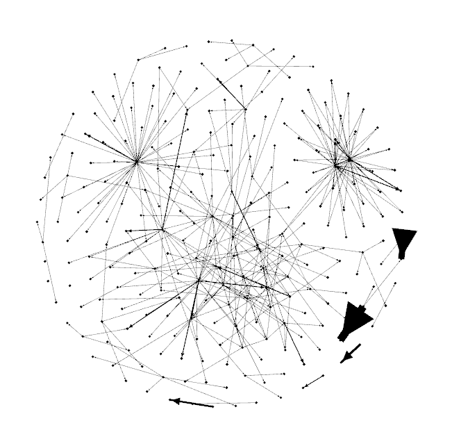

<!-- .slide: data-background-image="img/cropped-instin_climax_00.jpg" -->
<!-- .slide: class="hover"-->

## Éditorialisation et littérature le cas du Général Instin
&nbsp;

Servanne Monjour, Nicolas Sauret, Marcello Vitali-Rosati

 <!-- .element: class="logo" style="width:30%; background-color:ghostwhite;padding: 5px" -->

Des humanités numériques littéraires ?  
15-22 juin 2017

<!-- .element: style="font-size:1.4rem" -->

 <!-- .element: class="logo" -->

%%%%%%%%%%%%%%%%%%%%%%%%%%%%%%%%%%%%%%%%%%%%%
<!-- .slide: data-background-image="img/cropped-instin_climax_00.jpg" -->
<!-- .slide: class="hover"-->

### Sommaire

* Problématique générale
* Le cas Instin
* Axes de recherche :
  1. Question littéraire
  2. Question dispositive
  3. Question ontologique
* Conclusion

===

On peut écrire des notes ici.

%%%%%%%%%%%%%%%%%%%%%%%%%%%%%%%%%%%%%%%%%%%%%

<!-- .slide: data-background-image="img/0-ordonnancement_rubrique_105vagues.jpg" data-background-size="contain"--->
<!-- .slide: class="hover"-->

## Problématique générale

* Qu'est-ce que l'écriture à l'époque du numérique
  * écriture et espace
  * écriture et littérature
* Comment se transforment la production, la circulation et la légitimation des contenus?

===
Marcello:
Questions de recherche de la Chaire : qu'est-ce que la litt à l'époque du numérique ?
Comment changent les dispositifs d'écriture (production/ circulation / légitimation)

§§§§§§§§§§§§§§§§§§§§§§§§§§§§§§§§§§§§§§§§§§§§§

## Chaire de recherche du Canada sur les écritures numériques

 <!-- .element: width="45%" -->
 <!-- .element: width="45%" -->

%%%%%%%%%%%%%%%%%%%%%%%%%%%%%%%%%%%%%%%%%%%%%
<!-- .slide: data-background-image="img/generalinstinVitrail.jpg" -->

## Le cas Instin

§§§§§§§§§§§§§§§§§§§§§§§§§§§§§§§§§§§§§§§§§§§§§
<!-- .slide: data-background-image="img/instinss.jpg" -->

### Qu'est-ce qu'Instin ?

source image: _Quand on écrira l’histoire secrète du vingt et unième siècle…_ sur remue.net  

<!-- .element: class="source" -->

===

Notre cas d'étude est très difficile à décrire car hétérogène, mouvant, insaisissable.
Sa nature est de ne pas avoir de nature, d'en changer tout le temps.
On peut dresser cependant une première cartographie.

§§§§§§§§§§§§§§§§§§§§§§§§§§§§§§§§§§§§§§§§§§§§§
<!-- .slide: data-background-image="img/vitrailOriginal.jpg" data-background-size="contain"-->

source image: _introduction au feuilleton collectif Général Instin_ sur remue.net

<!-- .element: class="source" -->
===

Une photographie, prise par Juliette Soubrier en 1997. Il s'agit de la photo d'un vitrail qui orne une tombe, la tombe du Général **H**-instin, mort en 1905. Le vitrail s'est oxidé avec le temps et laisse désormais apparaitre cette figure fantomatique.

La même année (1997) Patrick Chatelier, écrivain français, reprend cette photo pour la proposer comme contrainte créative lors d'une soirée de performance au squat artistique de la Grange aux belles (Paris).

§§§§§§§§§§§§§§§§§§§§§§§§§§§§§§§§§§§§§§§§§§§§§
<!-- .slide: data-background-image="img/revueGeste.png" data-background-size="contain"-->

source image: revue-geste.fr  <!-- .element: class="source" -->
===

Cette photo du Général va inspirer les artistes présents, et marquer le début d'un collectif relativement informel (bien que très pro-actif), qui donnera lieu à quelques publications papier - et à différents atelier littéraires (+/- formels là aussi).

Entre temps, Hinstin a perdu son "H" qui le faisait personnage historique, pour devenir un matériau narratif, platisque, sémiotique. Il devient ainsi Général Instin svt abrégé GI.

§§§§§§§§§§§§§§§§§§§§§§§§§§§§§§§§§§§§§§§§§§§§§
<!-- .slide: data-background-image="img/item-026.png" data-background-size="contain" -->

source image: remue.net

<!-- .element: class="source" -->

===

Rapidement, GI insvestit la plateforme Remue.net, qui va jouer un rôle d'agrégateur / centralisateur des productions consacrées à Instin : poèmes, récits, beaucoup d'images, des vidéos et enregistrements (car bcp de lectures et d'ateliers commencent à être archivés).
GI prend donc racine dans l'hypertexte.

§§§§§§§§§§§§§§§§§§§§§§§§§§§§§§§§§§§§§§§§§§§§§
<!-- .slide: data-background-image="img/item-036.png" data-background-size="contain" -->

source image: generalinstin.net  <!-- .element: class="source" -->

===

Des expériences plus ponctuelles sur d'autres plateformes, en gagnant leur autonomie tout en s'inscrivant dans le projet GI - nous avons nommés "Spin-off" ces expériences.

§§§§§§§§§§§§§§§§§§§§§§§§§§§§§§§§§§§§§§§§§§§§§
<!-- .slide: data-background-image="img/toutesLesImages.png" -->

===

Les productions reliées au GI contiennent un aspect intermédial très fort, avec une production iconographique importante et foisonnante.
Identité visuelle - notamment autour du vitrail (mais nous avons identifié 3-4- patterns qu'il nous faudra étudier davantage) : memento mori / nature morte / land art.

§§§§§§§§§§§§§§§§§§§§§§§§§§§§§§§§§§§§§§§§§§§§§
<!-- .slide: data-background-image="img/Hinstin-famille.jpg" -->

source image: BNF  <!-- .element: class="source" -->

===

Au cours des années 2000, Retour de bâton : le collectif redécouvre que la famille Hinstin (avec son H), a en fait partie liée depuis longtemps avec la littérature et les arts - présent chez Jarry, Kessel.
La BNF dispose même d'un fond d'archive photo de la famille (qui d'ailleurs est bien connue des spécialistes de Lautréamont).
Comme quoi l'Histoire et l'histoire ne sont finalement pas si cloisonnés.

§§§§§§§§§§§§§§§§§§§§§§§§§§§§§§§§§§§§§§§§§§§§§
<!-- .slide: data-background-image="img/corpusFantome.png" -->

source image: _lexique généraliste_ sur remue.net

<!-- .element: class="source" -->

===
Bref, nous avons un corpus assez complexe - un corpus fantôme.
= Une des difficultés méthodo quand on travaille sur le comtemporain : un patrimoine mouvant, favorisant des pratiques expérimentales qui sont super, mais qui mettent en péril leur propre pérennité.  

§§§§§§§§§§§§§§§§§§§§§§§§§§§§§§§§§§§§§§§§§§§§§
<!-- .slide: data-background-image="img/sp38.png" -->
<!-- .slide: class="hover"-->

### Instin Studies

* Recherche, collecte et indexation du corpus
* Chaîne d'archivage, encodage et édition
* Exploration des données
* Réflexion épistémologique sur le projet

source image: _STREET-ART CAMPAGNE INSTIN_ sur sp38.com

<!-- .element: class="source" -->

===

A l'origine de notre projet, c'est l'intuition que ce qui était à l'oeuvre, et qui est toujours, avec le Général Instin est de nature à éclairer le questionnement de fond de la théorie de l'éditorialisation, sur la littérature, et sur son rapport au fait numérique.  
C'était aussi bien entendu, une curiosité toute scientifique face à un objet que l'on arrive à peine à nommer, un objet qui s'est employé très fort à brouiller les pistes d'une catégorisation possible, au point d'en faire un modus operandi.
>Par exemple, devrais-je dire : ce qui était à l'oeuvre _avec_ le général Instin ? ou _dans_ le général instin ? _sur_ le général instin ? On ne sait pas.

Devant un tel corpus, nous avons procédé de manière très organique, en élaborant notre méthodologie progressivement, de manière itérative en fonction des éléments que nous mettions à jour.

Nous pouvons séparer les différentes opérations en 4 tâches distinctes :
1. la recherche, la collection et l'indexation du corpus
2. l'implémentation d'une chaine de traitement pour encoder, archiver et éditorialiser le corpus
3. l'exploration et l'analyse des données récoltées
4. une réflexion continue, dont les axes se sont détachés et éclaircis progressivement. Ce sont ces axes de réflexions que nous présentons aujourd'hui, dans une version non aboutie.

Si ces 4 tâches peuvent sembler successives, nous les avons en fait mené de front, en parallèle, progressant pas à pas, selon les éléments collectés, selon les questions et hypothèses que nous souhaitions poser, selon les choix techniques que nos faisions pour les résoudre. Si l'on devait un jour aboutir ce projet, si tant est que cela est possible, nous estimons que nous en sommes aux premiers pas, à un petit 10%. 10% qui nous ont servi à débrousailler un corpus, élaborer une chaine d'archivage, produire quelques visualisations, mais surtout identifier des axes de recherche et lever une piste, des pistes, à suivre.

A nouveau, au-delà de la question ontologique de ce qu'est Instin, de ce qu'il nous dit des modes de publications, de la littérature contemporaine, du réel, lorsque chacun de ces champs d'actions ou champs d'études sont confrontés et travaillés dans la culture numérique, au delà de ces questions donc, a rapidement émergé la question épistémologique de ce que nous faisions d'Instin, dans une démarche auto-réflexive, récursive, tout à fait fertile puisque venant en miroir éclairer la première. Nous allons voir comment.

§§§§§§§§§§§§§§§§§§§§§§§§§§§§§§§§§§§§§§§§§§§§§
<!-- .slide: data-background-image="img/inventaireAtom.png" -->
<!-- .slide: class="hover"-->

### _inventaire.xml_

* Recherche, collecte et indexation :

  1. Exploration du corpus par propagation hypertextuelle
  2. Captation systématique (en cours)
  3. Ajout de sources antérieures à GI

Actuellement <i class="fa fa-arrow-right"></i> 76 _manifestations_ (dont 90% sources web)

===

L'inventaire s'est déroulé en trois temps :
  1. Exploration du corpus par propagation hypertextuelle
  2. Captation systématique (en cours)
  3. Ajout de sources antérieures à GI

Dans un premier temps, l'objectif était de faire un ballon d'essai avec 10 items, de réfléchir à leur indexation, aux métadonnées dont nous aurions besoin. Nous sommes partis d'un texte intitulé «G.I. [04.06.09]», publié sur la plateforme Remue.net sous le nom de fichier article3322.html. Nous l'avons indexé, et recensé les liens hypertextes contenus dans le texte.
Nous avons alors suivi le premier lien hypertexte, menant au texte intitulé «La campagne d'Egypte» (article1524.html), puis le second, et ainsi de suite, chaque nouveau texte nous menant soit à de nouveaux items, soit à des items déjà collectés.

Cette démarche n'était pas tout à fait arbitraire, même si son point de départ l'était, car elle était guidée par l'idée que les textes s'écrivaient ensemble, se répondaient entre eux, et formaient en fait une certaine unité, informe pour le moment, mais dont les hyperliens traçaient des pistes de lecture et d'écriture, comme le début d'une matrice de sens qu'il restait à dévoiler.

Il ne nous a pas échappé cependant que cette exploration par propagation hypertextuelle devait en principe remonter le temps d'Instin, les auteurs ne pouvant se référer à des textes postérieurs. A moins peut-être qu'une main ou qu'une intelligence artificielle ne complexifie la matrice en éditant les textes publiés de nouveaux hyperliens vers des textes plus récents. Ce que nous découvrirons par la suite.

A partir de 10, nous avons créé un fichier inventaire en xml et nous avons poursuivi cette approche par propagation hypertextuelle jusqu'à 30 items.

Puis nous sommes passés à une captation systématique, en nous appuyant sur les rubriques du site Remue.net. La captation est toujours en cours, nous en sommes à quelques 76 items, en incluant les éléments antérieures à GI : ce sont les éléments pré-instiniens, ceux dont servanne nous a parlé, notamment pour tenter de cerner Hinstin, au moins dans le temps.. timeline a suivre.

§§§§§§§§§§§§§§§§§§§§§§§§§§§§§§§§§§§§§§§§§§§§§
<!-- .slide: data-background-image="img/data-workflow.png" data-background-size="contain" -->

===

Très concrètement, voici à quoi ressemble notre chaine de traitement, de la collection jusqu'à l'éditorialisation de l'archive. Cette chaine

on retrouve les différentes étapes : Collection, encodage de l'archive, exploration des données, éditorialisation.

**avec** l'inventaire, les sources et la captation web des sources,

un script vient encoder ces sources en TEI et la mise en place d'une base de documents XML.

choix de la TEI : une approche initialement centrée sur le texte, même si on se rend compte progressivement à quel point les médias sont essentiels dans le paysage que dessine le corpus.

Par ailleurs, le passage d'un format HTML à un autre format fait sens dans cette démarche de production d'une archive, nécessité de distinguer les deux objets, que l'un ne soit pas simplement une copie de l'autre. Et nous reviendrons sur les effets et les refléxions que cette démarche a pu amener en dernière partie.

Le choix reste pertinent dans tous les cas, car la TEI nous donne toute latitude pour intégrer dans chacun des éléments les métadonnées d'archive dont nous avons besoin.

%%%%%%%%%%%%%%%%%%%%%%%%%%%%%%%%%%%%%%%%%%%%%
<!-- .slide: data-background-image="img/oeil.jpg" data-background-size="contain" -->
<!-- .slide: class="hover"-->

## Axes de recherche

1. Question littéraire
2. Question dispositive
3. Question ontologique

source image: _Traits 2_ sur remue.net

<!-- .element: class="source" -->

%%%%%%%%%%%%%%%%%%%%%%%%%%%%%%%%%%%%%%%%%%%%%
<!-- .slide: data-background-image="img/00-schema1-01floucinetique-2.jpg" data-background-size="contain" -->

## Question littéraire

source image: _Instin, plans de coupe, vues générales._ sur remue.net

<!-- .element: class="source" -->

§§§§§§§§§§§§§§§§§§§§§§§§§§§§§§§§§§§§§§§§§§§§§
<!-- .slide: data-background-image="img/rosecompas_grand.jpg" data-background-size="contain" -->
<!-- .slide: class="hover"-->

### De Hinstin à Instin

* Une contrainte créative
* Un projet collectif
* Un personnage de fiction
* L'Histoire et l'histoire

source image: _La place du mort_ sur remue.net

<!-- .element: class="source" -->

===
À la Grange-aux-Belles, Patrick Chatelier transforme le portrait en contrainte d’écriture : « J’ai montré les photos, j’ai un peu personnifié le général et je me suis aperçu que les artistes présents s’en emparaient pour en faire leur propre chose. C’est là que c’est devenu collectif. ».

C'est à ce moment que Hinstin perd son H « H qui le faisait humain historique » pour opérer ce passage vers la fiction, vers la littérature, pour devenir personnage-entité. Instin est donc, dans un premier temps, un sujet et un personnage de fiction auquel on invente une histoire, auquel on donne une seconde vie : tout le monde peut s’approprier cet « ancêtre universel ».

§§§§§§§§§§§§§§§§§§§§§§§§§§§§§§§§§§§§§§§§§§§§§
<!-- .slide: data-background-image="img/editionInstin.jpg" -->

### Un modèle hors-livre

* Occupation des marges
* Dissémination sur plusieurs supports/plateformes
* Investissement de l'espace public

source image: _Général Instin_ sur facebook.com

<!-- .element: class="source" -->

===

Ce qui nous intéresse notamment dans le projet GI est aussi ce qui nous cause le + de difficultés: GI se conçoit principalement dans un "hors-livre". C'est un projet éditorial complexe qui cependant s'inscrit en dehors de notre modèle éditorial traditionnel.

Depuis le squat de la Grange aux belles, il s'inscrit relativement à la marge - par "marge" on entend celles, principalement, des institutions littéraires mais encore plus éditoriales. Instin est généré dans :
- un squat
- ateliers d'écriture
- revues littéraires
- revue en ligne (Remue)
- sites web
- réseaux sociaux (FB + Twitter où il a ses propres profils)

Il est disséminé sur plusieurs supports, numériques/non-numériques, sur plusieurs plateformes, via des médias différents. Il occupe l'espace public - en même temps que l'espace public se redéfinit lui-même à l'ère numérique. De l'investissement d'un squat dans une rue de Paris jusqu'à l'investissement du web, des réseaux sociaux qui sont détournés pour créer un profil "fictif", nous avons tendance à croire qu'il y a là une même stratégie d'occupation des marges et de détournement des institutions, qui est essentiel pour comprendre les mutations qui affectent la notion même de littérature.

§§§§§§§§§§§§§§§§§§§§§§§§§§§§§§§§§§§§§§§§§§§§§
### Une littérature "brouhaha"

> « Publier » retourne à son sens originel : rendre public, passer de l’expression privée destinée à des correspondants précis à l’expression pour des publics de plus en plus divers.
>
> [C]ette multitude d’espaces publics caractérise le moment contemporain de la littérature, comme la sphère publique de la Littérature caractérisait sa représentation moderne. Si ces espaces publics ont toujours existé, même lorsqu’on les mettait sous silence, jamais ils n’ont été aussi nombreux et visibles […] si bien que le littéraire aujourd’hui apparaît en très grande partie comme une arène conflictuelle composée d’une sphère publique hégémonique reposant sur l’imprimé et d’une multitude d’espaces publics contre-hégémoniques relevant plutôt d’une « littérature-brouhaha » (exposée, performée, in situ, multi-support) avec de très nombreuses circulations entre eux. »
>
> Lionel Ruffel, _Brouhaha, Les Mondes du contemporain_

<!-- .element: style="font-size:1.4rem; text-align:justify" -->

===

Lionel Ruffel a proposé le terme de "littérature brouhaha" pour qualifier ce passage d'un imaginaire du littéraire centré sur le livre comme objet-support, à un imaginaire du littéraire centré sur une action et une pratique : la publication.

[après citation] Là où l’on invoque souvent, avec le numérique, l’idée de crise de l’édition (entraînant dans sa chute la littérature), ou la crainte d’une disparition du livre (avec une prétendue dématérialisation des textes), nous pouvons dire qu’il y a surtout une opposition forte à notre modèle éditorial moderne, qui nous permet peut-être de renouer avec certaines pratiques et certaines conceptions du fait littéraire, tel qu’elles existaient avant le XVIIIe.

§§§§§§§§§§§§§§§§§§§§§§§§§§§§§§§§§§§§§§§§§§§§§
<!-- .slide: data-background-image="img/sp38.png" -->

### Gestes de publication

source image: _STREET-ART CAMPAGNE INSTIN_ sur sp38.com

<!-- .element: class="source" -->

===
Ce que l'on qualifiera désormais de "gestes de publication" agit sur nos concepts littéraires hérités d'une culture éditoriale aujourd'hui mise à mal par le fait numérique.
- le texte : qui dans GI se conçoit énormément sous une forme orale, liée à la performance
- l'auteur : qui fait place à un collectif, puis une figure auctoriale ouverte
- l'oeuvre : qui semble n'avoir ni début ni fin et qui va se cristalliser sous une forme anthologique

§§§§§§§§§§§§§§§§§§§§§§§§§§§§§§§§§§§§§§§§§§§§§
<!-- .slide: data-background-video="http://vitalirosati.com/wp-content/uploads/2017/05/extrait-instin.mp4" -->

### Oralité, le retour

source video: _Rue Instin, le Film - 3. le futur_ sur vimeo.com

<!-- .element: class="source" -->

===
video : 9min + 11min30

[TEXTE] Parmi ces gestes de publication = oralisation et performativité des expériences Instiniennes.
Problème pour l'archivage et l'analyse d'une littérature qui s'énonce et se performe, bien plus qu'elle ne se lit.
L'idée n'est pas de dire que GI est "nouveau" et révolutionne la littérature sous l'effet du numérique.
Au contraire, on a un retour d'une certaine conception de la littérature.
Dans ses travaux sur l'oralité, Zumthor avait bien montré que le passage vers une culture de l'écrit avait marqué le début d'une distance que l’homme prenait envers lui-même, son éloignement de son propre corps: "Un art qui reposait sur des techniques d’assemblage, de combinaison, de collage, sans souci d’authentification des parties, recule et cède assez vite le terrain à un art nouveau, qu’anime une volonté de singularisation. La théâtralité généralisée de la vie publique commence à s’estomper, et l’espace se privatise."
C'est justement contre cette privatisation que semble oeuvrer Instin, en renouant avec la poésie au sens étymologique (un _faire_).

§§§§§§§§§§§§§§§§§§§§§§§§§§§§§§§§§§§§§§§§§§§§§
<!-- .slide: data-background-image="img/campagneNonOfficielle.png" -->
<!-- .slide: class="hover"-->

### Du libre-accès au libre-service : les "GI Commons"

> Il n’y a pas de chef, pas d’organisation, c’est un fonctionnement particulier. Il n’y a jamais eu non plus de comité de rédaction. Ni de réunion. Une tentative de séminaire a capoté. Il y a des opportunités et des gens qui vont s’investir, longtemps ou pas, dans cette entité.
>
> Patrick Chatelier  

<!-- .element: style="font-size:1.4rem; text-align:justify" -->

source image: _Général Instin_ sur facebook.com

<!-- .element: class="source" -->

===

[AUTORITÉ] le concept d’autorité est mis en crise. Pas besoin de demander l’autorisation pour utiliser Instin – entité en libre-service autant qu’en libre-accès. N’importe qui peut se l’approprier – comme sujet de l’écriture, comme personnage à mettre en scène, comme signature aussi. 200 personnes se sont agrégées à ce projet au fil des vingt dernières années. On pourrait parler de contributeurs plutôt que d'auteurs, d'ailleurs venus de multiples horizons (littérature, poésie, performance, arts visuels...).

Une expression émerge "celle de GI commons" - Instin serait donc un commun.

§§§§§§§§§§§§§§§§§§§§§§§§§§§§§§§§§§§§§§§§§§§§§
<!-- .slide: data-background-image="img/CV-GI-def.jpg" -->
<!-- .slide: class="hover"-->

### GI, une anthologie

* Un collectif
* Une figure auctoriale
* Un "retour" au modèle imprimé?

===

[OEUVRE] On a dit la difficulté avec notre corpus fantôme. Surprise: Instin opère un retour fracassant dans l’univers du livre imprimé sous la forme d’une anthologie.

Inquiétude: Instin se trahirait-il ? Retour à l'imprimé comme une forme d'institutionnalisation ?

Le choix de la forme anthologique doit nous rassurer et même nous conforter.

§§§§§§§§§§§§§§§§§§§§§§§§§§§§§§§§§§§§§§§§§§§§§
<!-- .slide: class="hover"-->

### Culture numérique, culture anthologique

> «Comment expliquer le fait que l’anthologie soit la forme et le format par excellence de la civilisation numérique ? Les recueils de « fleurs » (anthos en grec veut dire « fleur »), censés tenir lieu d’une totalité difficilement accessible dans son intégralité, se sont généralisés, pour représenter non plus un choix ou une sélection dictés par des contraintes matérielles, mais plutôt des fragments conçus et formés pour la circulation et la transmission dans un environnement qui valorise une nouvelle manière de lire et d’écrire. Le fragment, ou toute pièce, tout document de n’importe quelle nature, est citable, mais surtout il se livre à des formes d’intégration dans des outils d’écriture qui sont presque toujours aujourd’hui des outils d’échange et de partage. Cette tournure anthologique, qui s’accentue avec les derniers outils et se confirme avec les nouvelles pratiques, implique une transformation déterminante de nos rapports avec les objets culturels de tous les genres et le savoir tout court. »
>
> Milad Doueihi, _Pour un humanisme numérique_, Seuil, 2011

<!-- .element: style="font-size:1.4rem; text-align:justify" -->

===
L’anthologie, c’est une forme éditoriale ancienne dans notre histoire littéraire et qui, pourtant, serait « la forme et le format par excellence de la civilisation numérique » selon Milad Doueihi (citer).

L’anthologie GI est donc la forme par excellence de la littérature-brouhaha, qui permet de cristalliser à un moment donner cette mosaïque de texte, collection de fragments, collectif d’écrivains, sans pour autant en marquer l'arrêt.

%%%%%%%%%%%%%%%%%%%%%%%%%%%%%%%%%%%%%%%%%%%%%
<!-- .slide: data-background-image="./img/mashupInstin.png" -->

## Question dispositive

===

Le cas Instin est particulièrement intéressant pour essayer de comprendre ce que devient le dispositif dans l'environnement numérique.

La notion de dispositif a toujours été problématique, elle fait partie de ces termes indéfinissables, insaisissables que tout le monde manipule malgré tout (et je pense avec raison).

§§§§§§§§§§§§§§§§§§§§§§§§§§§§§§§§§§§§§§§§§§§§§

Pour Foucault :

>  «Ce que j'essaie de repérer sous ce nom c'est, [...] un ensemble résolument hétérogène comportant des discours, des institutions, des aménagements architecturaux, des décisions réglementaires, des lois, des mesures administratives, des énoncés scientifiques, des propositions philosophiques, morales, philanthropiques ; bref, du dit aussi bien que du non-dit, voilà les éléments du dispositif.
>
> Le dispositif lui-même c'est le réseau qu'on établit entre ces éléments [...].
>
> C'est ça le dispositif : des stratégies de rapports de force supportant des types de savoir, et supportés par eux»
>
> Foucault, _Dits et écrits_, volume III, p.299 _sq_ (1977)

<!-- .element: style="font-size:1.4rem; text-align:justify" -->

===
Pour Foucault, c'est "un ensemble hétérogène", un "réseau", une "stratégie de rapport de force".

§§§§§§§§§§§§§§§§§§§§§§§§§§§§§§§§§§§§§§§§§§§§§

Pour Agamben :

> «Tout ce qui a, d'une manière ou d'une autre, la capacité de capturer, d'orienter, de déterminer, d'intercepter, de modeler, de contrôler et d'assurer les gestes, les conduites, les opinions et les discours des êtres vivants.»
>
> Agamben, _Qu'est-ce qu'un dispositif ?_ 2007

<!-- .element: style="font-size:1.4rem; text-align:justify" -->

===
Agamben fait une Partition générale et massive de l'être entre :

1. les êtres vivants (ou les substances) : l'ontologie des créatures
2. les dispositifs, à l'intérieur desquels les êtres ne cessent d'être _saisis_.

[Citation Agamben]

Mais la compréhension générale que l'on a du terme se complique lorsqu'on tente de l'amener sur le terrain numérique, où les relations de pouvoir et d'autorité sont profondément remaniées.

Le dispositif revêt notamment un caractère déterministe, en particulier chez Foucault, qui doit être questionné, et c'est notamment à cela que la notion d'éditorialisation nous est utile, comme nous le montrera Marcello.

§§§§§§§§§§§§§§§§§§§§§§§§§§§§§§§§§§§§§§§§§§§§§

<!-- .slide: data-background-image="img/rubon622.jpg" -->

### Dispositif GI ?

===

Ainsi la première question que l'on s'est posé  : quel est le dispositif Instin ? Quel est l'agencement des forces et des autorités qui ont engendré son écriture.

Qui écrit ? où ? mais aussi comment écrit-on Instin ? Y a t il des motifs récurrents et si oui, d'où viennent-ils ? cad aussi, qu'est ce qui _prédispose_ l'écriture du GI ?

Première intuition: il n'y a pas de dispositif : Les méta-discours qui accompagnent les différents fragments d'instin insistent sur le fait qu'instin est un projet sans forme, sans autorité, que tout à chacun peut s'approprier le général, produire un texte, commettre une performance, etc.

Cette intuition est aussi renforcée par l'élongation dans le temps du projet, le fait que les textes et les formes semblent s'accumuler sans poursuivre un objectif précis, si ce n'est celui de produire, aussi celui de faire collectif, celui d'une rhétorique (rhétorique dispositive).

§§§§§§§§§§§§§§§§§§§§§§§§§§§§§§§§§§§§§§§§§§§§§
<!-- .slide: data-background-image="img/vitrailOriginal.jpg"   data-background-size="contain"  -->

===

Productions touffue, oeuvre indéfinissable, collectif multi-forme, ou plutôt à géométrie variable : produit un sentiment d'insaisissabilité du projet et de l'oeuvre, similaire au sentiment face à cette photo du vitrail : une figure insaisissable, aux contours flous, même la direction du regard s'est perdue.

[Vitrail]

Enfin, c'est l'effacement des auteurs, derrière la figure du général, tout à la fois sujet, narrateur, auteur, dans le glissement auctoriale que Servanne a mentionné.

Toutes ces raisons laissent penser que le dispositif est absent.

C'est cette absence supposée de dispositif qui permet justement de poser en creux la question du dispositif, et de se demander ce qu'il devient dans un tel projet, comment il opère, et s'il n'est plus là, qu'est ce qui le remplace.
Autrement dit, de même qu'Instin constitue intuitivement un cas d'étude idéal de littérature contemporaine, il pourrait nous éclairer sur la nature d'un environnement-dispositif, c'est à dire sur une forme de dispositif ouvert à toute forme d'appropriation de lui-même.

§§§§§§§§§§§§§§§§§§§§§§§§§§§§§§§§§§§§§§§§§§§§§
<!-- .slide: data-background-image="./img/Composition3Graphes_large.png" data-background-size="cover" -->
<!--  .slide: class="hover"-->

* un ensemble ouvert et dynamique, mais fini
* deux structures classiques :
  1. organisation arborescente
  2. organisation rhizomatique
* centralité de certains acteurs et plateformes

===
L'archivage en cours de GI nous amène finalement à cerner le corpus en un ensemble fini. Avec un nombre d’auteurs, de contributions, de plateformes maîtrisables. Elle nous montre par ailleurs que c'est un corpus organisé et distribué dans des rubriques identifiées.

Il y a là deux organisations qui se font face : celle arborescente des plateformes (voir les rubriques de Remue.net), et celle rhizomatique des textes hyperliées.

En fait, ce que nous a montré nos premiers pas dans la constitution de l'archive GI, c'est qu'il existe malgré tout des noeuds de cristallisation, des acteurs à la centralité plus ou moins prégnante, des formes, elles-mêmes investies de leur dispositif.

Ici, nos premiers pas dans la fouille de données : extraire tous les liens contenus dans le corps de texte du corpus et à produire une matrice d'adjacence à partir de ces liens. Cela nous donne un réseau de documents que nous avons pu spatialiser.

§§§§§§§§§§§§§§§§§§§§§§§§§§§§§§§§§§§§§§§§§§§§§

 <!-- .element: width="60%" -->

_Forced-based spatialisation (Fruchterman Reingold)_  <!-- .element: style="font-size: 1.4rem" -->

===
Une première spatialisation (Fruchterman Reingold)

utilisé pour ces premières exploration pour garder un visualisation relativement neutre, révélant des relations sans trop les caractériser : nous permet de garder un lien particulier avec les sources et poursuivre une lecture rapprochée :

réseau de documents, nous montre très clairement que le corpus s'agence et se partitionne

§§§§§§§§§§§§§§§§§§§§§§§§§§§§§§§§§§§§§§§§§§§§§

 <!-- .element: width="60%" -->

Centralité de vecteur propre  <!-- .element: style="font-size: 1.4rem" -->

===
Ainsi, un calcul de centralité vient confirmer qu'il existe dans ce corpus des hubs, des textes plus importants que les autres, davantage cités que les autres, ...

(centralité de vecteur propre (eigen vector))

§§§§§§§§§§§§§§§§§§§§§§§§§§§§§§§§§§§§§§§§§§§§§

 <!-- .element: width="50%" -->
 <!-- .element: width="40%" -->

_La campagne d’Égypte_, Patrice Chatelier (2006)  

<!-- .element: style="font-size: 1.4rem" -->

===
comme c'est le cas de La Campagne d'Egypte de Patrice Chatelier, un des premiers textes du GI sur remue.net.

peut-être biaisé par le fait que notre première approche pour la collection du corpus (pour les 30 premiers items) a été de procéder par propagation à partir des liens hypertextes, et que donc nécessairement, les premiers items collectés sont particulièrement connectés entre eux.

§§§§§§§§§§§§§§§§§§§§§§§§§§§§§§§§§§§§§§§§§§§§§

 <!-- .element: width="60%" -->

Modularité  <!-- .element: style="font-size: 1.4rem" -->

===
le calcul de modularité nous donne une partition en une dizaine de "communautés", ce qu'on n'interprétera pas à ce stade à cause d'un corpus incomplet, mais cela vient ...

§§§§§§§§§§§§§§§§§§§§§§§§§§§§§§§§§§§§§§§§§§§§§

 <!-- .element: width="55%" -->
 <!-- .element: width="40%" -->

_Base acide_, Anne Kawala (2013)  

<!-- .element: style="font-size: 1.4rem" -->

===
... aussi réveler **des formes d'écritures**, comme ce texte dont une trentaine de termes sont associés à une notice de wiktionnary.

§§§§§§§§§§§§§§§§§§§§§§§§§§§§§§§§§§§§§§§§§§§§§

<!-- .slide: data-background-image="img/rubon622.jpg"  -->

### «dispositive» _(adj.)_

===

Et ainsi, ces différentes manifestations produisent ensemble un archipel dont les contours sont finalement relativement identifiables.

Pour mieux penser ce dispositif, nous faisons appel au glissement syntaxique introduit par Louise Merzeau et qui nous semble particulièrement pertinent et opérant :
Louise parle en 2013 d'_action dispositive_, c'est-à-dire d'une action à la fois opérée dans la cadre d'un dispositif mais aussi contributive et constitutive du dispositif, puis de rhétorique dispositive. En 2016, elle parle encore de rhétorique dispositive, cette capacité d'écrire et de nous écrire dans l'environnemnt numérique ou environnement-dispositif.

En glissant du concept à l'adjectif, nous abandonnons le _dispositif_, mais sans en abandonner la fonction.

Ainsi, il n’y a pas de dispositif formel Général Instin, mais Instin produit un environnement _dispositif_ dans lequel les actions sont des _écritures dispositives_.

Ce glissement n'est pas anodin, il permet de nous rapprocher de la nature-même du dispositif Instin, en tant que média, ou en tant que milieu, et par ailleurs d'invoquer la théorie de l'éditorialisation pour comprendre comment la nature environnementale du numérique travaille les dispositifs littéraires, tant du côté de l'écriture que de la lecture. Ce qui permet notamment de penser les pratiques d'écritures et de lectures non pas de facon hors-sol, mais liées par essence aux dispositifs ou plus exactement à leur milieu.

§§§§§§§§§§§§§§§§§§§§§§§§§§§§§§§§§§§§§§§§§§§§§
<!-- .slide: data-background-image="img/textopoly3.jpg" data-background-size="cover" -->

### GI, un rhizome ?

===

Reste à caractériser ce milieu dispositif qu'est Instin, à en identifier les dynamiques d'autorité et les modalités de ce milieu.

La figure du rhizome nous vient à l'esprit.

§§§§§§§§§§§§§§§§§§§§§§§§§§§§§§§§§§§§§§§§§§§§§
<!-- .slide: data-background-image="img/rhizome.jpg" -->
<!-- .slide: class="hover"-->

### Rhizome selon Deleuze et Guattari

* Connexion
* Hétérogénéité
* Multiplicité
* Rupture asignifiante
* Cartographie
* Décalcomanie

§§§§§§§§§§§§§§§§§§§§§§§§§§§§§§§§§§§§§§§§§§§§§
<!-- .slide: data-background-image="img/machine_guerre.jpg" data-background-size="cover" -->
<!-- .slide: class="hover"-->

### Machine de guerre

* Question littéraire :
  * La photo comme pivot
  * La pluralité des formes d’écriture (_Littérature brouhaha_)
* Question numérique :
  * Internet, et le numérique, ne sont pas que réseau

===

Enrico est lancé
Enrico lance Marcello sur l'éditorialisation

§§§§§§§§§§§§§§§§§§§§§§§§§§§§§§§§§§§§§§§§§§§§§
<!-- .slide: data-background-image="./img/mashupInstin.png" -->
<!-- .slide: class="hover"-->

### La notion d'éditorialisation

* **2004-2007: apparition du mot**
  * Une sorte d'édition dans l'environnement numérique
  * Bachimont : passage d'un document non-numérique à un document numérique

* **2008: le terme s'institutionnalise**
  * Sens public: formes de production et de circulation de la connaissance en environnement numérique
  * Laboratoire MSH: Pratiques interdisciplinaires et circulation du savoir : vers une éditorialisation des SHS (Wormser, Vitali-Rosati)

===
(marcello est lancé)
éditorialisation: penser un processus ouvert où auteurs, collectivités, plateformes, dynamiques pratiques sont mêlées et difficiles à retracer. pas curation, pas édition... éditorialisation
poutant ça produit une émergence de sens

§§§§§§§§§§§§§§§§§§§§§§§§§§§§§§§§§§§§§§§§§§§§§
<!-- .slide: data-background-image="./img/mashupInstin.png" -->
<!-- .slide: class="hover"-->

### La notion d'éditorialisation

>«L'éditorialisation désigne l'ensemble des dynamiques qui produisent et structurent l'espace numérique. Ces dynamiques sont les interactions des actions individuelles et collectives avec un environnement numérique particulier.»
>
> Vitali-Rosati, _Qu'est-ce que l'éditorialisation?_, Sens public 2016

<!-- .element: style="font-size:1.6rem; text-align:justify" -->

===

§§§§§§§§§§§§§§§§§§§§§§§§§§§§§§§§§§§§§§§§§§§§§
<!-- .slide: data-background-image="./img/mashupInstin.png" -->
<!-- .slide: class="hover"-->

### Caractéristiques de l'éditorialisation

- ouverte
  - plusieurs plateformes
  - plusieurs acteurs
  - toujours inachevée
- processuelle
- collective

===
(différence avec la curation de contenus)

§§§§§§§§§§§§§§§§§§§§§§§§§§§§§§§§§§§§§§§§§§§§§
<!-- .slide: data-background-image="img/10458166_10153074634228797_4994304635406227180_n.jpg" -->
<!-- .slide: class="hover"-->

### L'espace

- Espace mathématique et espace social
- L'espace porte des valeurs - le nomos de Schmitt (cf. Agostini-Marchese)

===

On a dit que l'édito produit l'espace: mais qu'est-ce que l'espace?

§§§§§§§§§§§§§§§§§§§§§§§§§§§§§§§§§§§§§§§§§§§§§
<!-- .slide: data-background-image="img/panInstin.png" -->
<!-- .slide: class="hover"-->

## Espace numérique

  1. un espace architectural
  - un espace réel
  - un espace hybride
  - un espace en mouvement

===

Notes

§§§§§§§§§§§§§§§§§§§§§§§§§§§§§§§§§§§§§§§§§§§§§
<!-- .slide: data-background-image="img/nomos.jpg" -->
<!-- .slide: class="hover"-->

## Espace et _nomos_

- Milieu
- Technique/technologie
- Instances de l’autorité
- Le symbolique et l’imaginaire

===

Enrico doit faire le lien vers la question ontologique

%%%%%%%%%%%%%%%%%%%%%%%%%%%%%%%%%%%%%%%%%%%%%
<!-- .slide: data-background-image="img/reveGeneral.png" -->

## Question ontologique

§§§§§§§§§§§§§§§§§§§§§§§§§§§§§§§§§§§§§§§§§§§§§
<!-- .slide: data-background-image="img/StLouisNavire.JPEG" -->

### Origine(s)

===

frontières : quand GI commence ??
  la photo ? chatelier ? les premières manifestations littéraires sur **H**-instin, ou toute inscription du nom Hinstin : l'acte de naissance d'Hinstin , l'acte de décès (il produit le vitrail),
  voir à la BNF : un fond photographique dédié à la famille Hinstin (+ navire de guerre), en lien avec Lautréamont (alias Isidore Ducasse)

on ne répond pas à la question

§§§§§§§§§§§§§§§§§§§§§§§§§§§§§§§§§§§§§§§§§§§§§

<iframe data-src='https://cdn.knightlab.com/libs/timeline3/latest/embed/index.html?source=18rhwdJjrIvOahi_L70BqDT9x8_EKqmxgsPQk7AFtnog&font=Default&start_at_slide=19&lang=fr&initial_zoom=21&height=650' width='100%' height='650' webkitallowfullscreen mozallowfullscreen allowfullscreen frameborder='0'></iframe>

===

présentation de la timeline
timeline encore une tentative,
catégorisation : celles des sites..

objectifs : proposer d'autres catégorisations

mais aussi d'autres formes de visualisation

à partir de la Timeline, constat :
  * on a observé que les frontières n'étaient pas si évidentes : frontières temporelles et spatiales de l'objet
  * frontières ontologiques :
  - documents d'archive historique
  - catégories de Remue qui mélange texte de fiction + archivage de leur propre travail

Timeline = illustration de notre corpus fantôme, sans véritable début ni fin.

§§§§§§§§§§§§§§§§§§§§§§§§§§§§§§§§§§§§§§§§§§§§§
<!-- .slide: data-background-image="img/instinPapier.png" -->

### Spin-offs

===

La particularité des spins-offs, qui sont plus récent = publications papier sous le nom d'Instin :
* Climax : réflexion sur l'archive
* Spoon River : côté anthologique qui revient

+ réinscrition dans la forme papier
+ et évolution d'instin en Autorité

§§§§§§§§§§§§§§§§§§§§§§§§§§§§§§§§§§§§§§§§§§§§§
<!-- .slide: data-background-image="img/adamique.png" -->

===
Lire le texte.

§§§§§§§§§§§§§§§§§§§§§§§§§§§§§§§§§§§§§§§§§§§§§
<!-- .slide: data-background-image="img/arton2702.jpg" data-background-size="contain"-->

### Histoire et mémoire collective

===

La question du H - dont la disparition ne fait finalement que rendre plus présente la question historique, pose question : confrontation entre l'objet littéraire et l'objet historique ?
Plutôt, idée que l'histoire est de toutes les façons en construction, pas en opposition avec la fiction.

On pourrait se demander si, finalement, notre chronologie linéaire ne devrait pas se transformer en cercle où le réel viendrait mordre la queue du récit : la photographie du vitrail serait un point de basculement entre la chronologie de "vrai" général et celle du GI - qui finalement se sont mutuellement façonnés.

§§§§§§§§§§§§§§§§§§§§§§§§§§§§§§§§§§§§§§§§§§§§§
<!-- .slide: data-background-image="img/vitrailOriginal.jpg"-->
<!-- .slide: class="hover"-->

### Pourquoi le GI ?

Qu'est ce qui a permis à GI de fonctionner ?

===

L'intuition qu'Instin est davantage qu'un terrain de jeu : il semble pouvoir révéler quelque chose de notre mémoire collective, de notre identité.

Il y a dans GI tous les ingrédients du mème.

§§§§§§§§§§§§§§§§§§§§§§§§§§§§§§§§§§§§§§§§§§§§§
<!-- .slide: data-background-image="img/errants.png"-->

===

Lire le texte

§§§§§§§§§§§§§§§§§§§§§§§§§§§§§§§§§§§§§§§§§§§§§
<!-- .slide: data-background-image="img/G.I.-15h26--.jpg" data-background-size="contain"-->
<!-- .slide: class="hover"-->

### Imaginaire/réel

* espace numérique et brouillage des frontières
* fusion entre texte, paratexte et épitexte
* superposition de discours littéraire et non littéraire

===

Statut ontologique de la littérature
Espace
P. Valéry

§§§§§§§§§§§§§§§§§§§§§§§§§§§§§§§§§§§§§§§§§§§§§
<!-- .slide: data-background-image="img/projet.png"-->

===

Lire le texte.

%%%%%%%%%%%%%%%%%%%%%%%%%%%%%%%%%%%%%%%%%%%%%
<!-- .slide: data-background-image="img/archive.png" -->
## Archiver Instin

===

L'archivage d'instin a soulevé différentes questions intéressantes :

1. la possibilité d'une totalisation d'un corpus fantome ?
2. la nécessité de conserver et d'étudier des formes littéraires à la marge, et on revient à la question de recherche qui nous a été présenté lundi par Bridget Christine Moynihan, ce qu'elle appellait le "prismatic fringes", les espaces marginaux.

Avec la question : comment l'archive, et plus spécifiquement l'édition numérique de l'archive peut modifier du statut de ces oeuvres. Comment la mise en archive travaille l'objet source.

3. engin la classification d'un tel corpus, aux sources multiples, multimodales, dont les frontières entre épi para et contenu n'est pas si claire, ce qui repose la question ontologique d'instin.

---

éditorialisation de l'archive et conséquence ontologique

La question du statut des manifestations :
  * entre l'origine historique
  * les premières manifestations littéraires
  * les origines du projet GI
  * les documentations de performance ou d'ateliers
  * les visuels des graphes : où se place l'écriture ? qu'est ce qui participe à Instin : l'acte de peindre dans la rue, la captation photographique, la publication de la photographie sur un blog ?

tentative vaine de totalisation

Archivage : processus de légitimation d'une littérature hors institution, ce que

Instin : occupation volontaire des marges: qu'est ce que veut dire l'archivage des marges.

Problématique d'étude littéraire : la perte chez les surréalistes

§§§§§§§§§§§§§§§§§§§§§§§§§§§§§§§§§§§§§§§§§§§§§

> «&nbsp;Depuis quelques années [le terme "littérature"] tend à se dissiper comme objet de connaissance, voire simplement de perception. Simultanément, le statut de l’«&nbsp;histoire de la littérature&nbsp;» est remis en question. De telles incertitudes ne sont pas propres à notre époque ; elles s’associent aux regrets qu’inspire périodiquement depuis trois siècles une prétendue décadence de la culture livresque : constante paradoxale, où l’on pourrait discerner les accès récurrents d’une nostalgie de la voix vive. Mais la logique discursive qui constitua notre « littérature » fonctionne aujourd’hui de pis en pis ; une menace d’aliénation connote plus ou moins tous les sens produits par elle. Preuve en soit la fortune dont jouit pendant une vingtaine d’années la «&nbsp;théorie littéraire&nbsp;» : compensation — peut-être honteuse — d’une perte de foi en la validité des littératures.»
>
> Paul Zumthor, _La Voix et la lettre_

<!-- .element: style="font-size:1.6rem; text-align:justify" -->

§§§§§§§§§§§§§§§§§§§§§§§§§§§§§§§§§§§§§§§§§§§§§
<!-- .slide: data-background-image="img/archive.png" -->
<!-- .slide: class="hover"-->

## Editorialisation de l'archive

* double dynamique :
  * ouverture et continuité : rendre l'archive publique et appropriable
  * réflexivité : que nous dit le design de l'archive sur le dispositif GI lui-même

===
fidèle à nos questions de recherche, nous pouvions pas penser l'archivage sans penser l'éditorialisation de l'archive, en considérant que l'espace que nous essayons de construire pourrait nous permettre de comprendre l'espace, ou le nomos Instin.

l'éditorialisation nous projette dans une double dynamique :

* dynamique d’ouverture : dans la continuité de l’esprit du Général Instin, cette éditorialisation pourrait avoir vocation à devenir publique, accessible, appropriable.
  * ce qui nous fait poser la question : sommes nous certains que toute cette production scientifique est un épiphénomène lié à instin, ou participe-t-elle d'instin ? est-on en train de produire sur la matrice instin, nous sommes nous vraiment extraits de la rhétorique instinienne ?
* dynamique réflexive ou peut-être récursive sur notre projet : en faisant le pari que la conception du dispositif d’éditorialisation de l’archive nous éclairera sur le dispositif GI lui-même.

Ce pari est celui d’un dialogue entre le dispositif de publication littéraire du GI et le dispositif d’une archive scientifique. Un dialogue tout en tension, tout en contradiction peut-être, mais dont la démarche fait sens pour considérer l’archive non pas comme une tentative de totalisation de GI, mais plutôt de projection en miroir, elle-même excroissance du projet.

Nous sommes encore au tout début du projet, c'est un projet extrêmement riche qui nous ouvrent de nouvelles questions de recherche toutes les semaines.

La démarche d'éditorialiser l'archive en cours de construction participe aussi de cette volonté d'ouvrir le projet à la collaboration et à des approches complémentaires des nôtres.

%%%%%%%%%%%%%%%%%%%%%%%%%%%%%%%%%%%%%%%%%%%%%
<!-- .slide: data-background-image="img/iLoveInstin.jpg" data-background-size="contain" -->
<!-- .slide: class="hover"-->

### Merci !

à suivre sur [nicolassauret.net/behindinstin](http://nicolassauret.net/behindinstin)

 <!-- .element: class="logo" style="width:30%; background-color:ghostwhite;padding: 5px" -->

_Des humanités numériques littéraires ?_  
15-22 juin 2017

<!-- .element: style="font-size:1.4rem" -->

 <!-- .element: class="logo" -->
